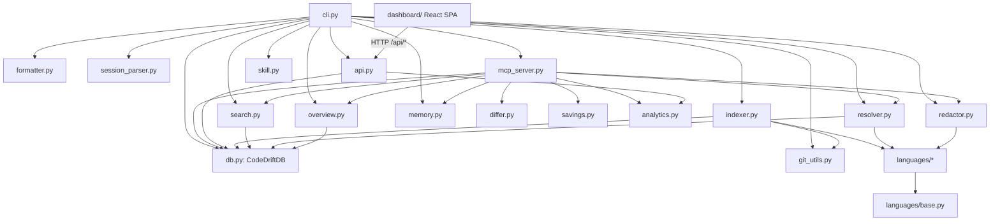
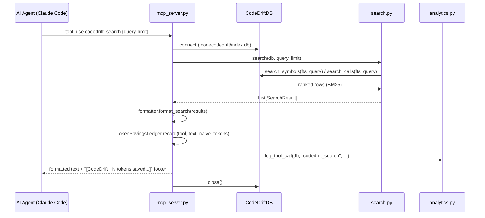
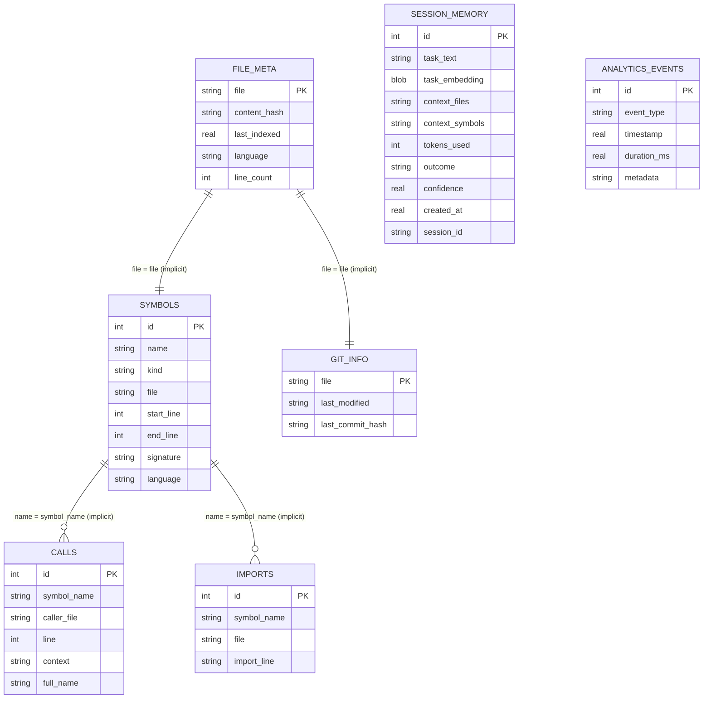
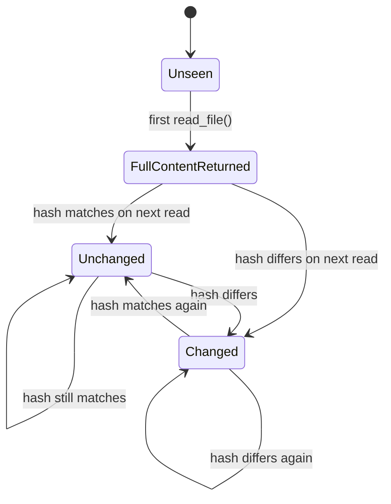

# CodeDrift — Master Reference

> **Last updated:** 2026-07-13 — initial generation via `/create-documentation`

---

## Section 1 — Project Identity

**Name:** CodeDrift
**One-liner:** A tree-sitter-based code index and MCP server that gives AI coding agents (e.g. Claude Code) token-efficient, symbol-level access to a codebase instead of naive grep/glob/read loops.

**Problem it solves:** AI coding agents repeatedly burn tokens rediscovering context — grep, glob, read a file, realize it's wrong, read another. CodeDrift parses a project with tree-sitter into a local SQLite index (functions, classes, imports, call sites, full-text search), then serves that index through three surfaces: a CLI, an MCP stdio server (`codedrift_search`, `codedrift_resolve`, `codedrift_overview`, `codedrift_read`, `codedrift_memory`), and a FastAPI + React analytics dashboard. It also tracks per-session file reads to return diffs instead of full re-reads, estimates token savings, supports cross-session "memory" recall of past task→context mappings via sentence embeddings, and can redact PII/secrets from file content before it reaches an LLM.

**End users / stakeholders:** Individual developers running Claude Code (or any MCP-compatible agent) against their own repositories; the project maintainer/author (`darshil3011`) as an open-source solo/small-team effort with at least one external contributor (`jagdish31502`).

**Status:** Active. Version `0.1.0` per `pyproject.toml`; most recent commits (July 2026) added the analytics dashboard and fixed tree-sitter package-version conflicts.

**Links:**

| Link | URL |
|---|---|
| GitHub repository | https://github.com/darshil3011/codedrift |
| Author LinkedIn | https://linkedin.com/in/darshil3011 |
| tree-sitter | https://tree-sitter.github.io |
| PII redaction model | https://huggingface.co/openai/privacy-filter |

**Tech stack:**

| Layer | Technology | Version |
|---|---|---|
| Core language | Python | ≥3.10 |
| CLI framework | click | ≥8.0 |
| Parsing | tree-sitter / tree-sitter-language-pack | ≥0.24.0 / ≥0.2.0 |
| Storage | SQLite (stdlib `sqlite3`) + FTS5 | — |
| MCP server (optional `mcp` extra) | `mcp` (official SDK) | ≥1.0 |
| Cross-session memory (optional `memory` extra) | sentence-transformers (`all-MiniLM-L6-v2`) + numpy | ≥2.0 / ≥1.24 |
| PII redaction (optional `redact` extra) | onnxruntime + tokenizers + huggingface_hub | ≥1.18 / ≥0.19 / ≥0.24 |
| Dashboard backend (optional `dashboard` extra) | FastAPI + uvicorn | ≥0.110 / ≥0.29 |
| Dashboard frontend | React + TypeScript + Vite | React 19.2.5, Vite 8.0.10, TS ~6.0.2 |
| Dashboard styling | Tailwind CSS | v4.3.0 |
| Dashboard data/charts | @tanstack/react-query, recharts | 5.100.9 / 3.8.1 |
| Testing | pytest, pytest-cov (`dev` extra) | ≥7.0 |
| Packaging | setuptools | ≥61 |

---

## Section 2 — Folder Structure

```text
codedrift/                       # repo root
├── assets/                      # static images used by README (e.g. comparison.svg) — hand-written/vendored asset
├── benchmark.py                 # standalone script: analyzes Claude Code session logs for token savings
├── CLAUDE.md                    # tool-priority instructions for Claude Code, written/appended by codedrift/skill.py
├── CODEDRIFT_LAYER3_PLAN.md     # design/planning doc for the session-memory feature (historical reference)
├── LICENSE                      # MIT license
├── pyproject.toml                # package metadata, dependencies, optional extras, pytest config
├── README.md                    # user-facing documentation
├── .gitignore
├── .claude/
│   └── settings.json             # local Claude Code permission settings (hand-written)
├── .codecodedrift/               # RUNTIME DATA — the project's own CodeDrift index (gitignored)
│   ├── index.db                  # SQLite index (auto-generated by `codedrift init`)
│   └── redact.json               # PII redaction config (auto-generated by `codedrift redact enable`)
├── codedrift/                    # MAIN PYTHON PACKAGE — hand-written source of truth
│   ├── __init__.py                # package docstring + __version__
│   ├── analytics.py                # analytics_events read/write helpers (tool usage, savings, heatmap, memory hit-rate)
│   ├── api.py                      # FastAPI app serving the dashboard's JSON endpoints + static SPA
│   ├── cli.py                      # click CLI entry point — every `codedrift <subcommand>`
│   ├── db.py                       # SQLite storage layer: schema, FTS5 tables, triggers, all queries
│   ├── differ.py                   # DiffLedger — session-scoped "full read once, diff thereafter" tracker
│   ├── formatter.py                 # renders SearchResult/ResolveResult/overview/stats as text or JSON
│   ├── git_utils.py                  # git CLI subprocess wrapper (commit metadata, post-commit hook install)
│   ├── indexer.py                    # filesystem walk + tree-sitter parse + persist pipeline (index_project)
│   ├── languages/                    # per-language tree-sitter adapters (strategy pattern)
│   │   ├── __init__.py                 # extension → adapter registry (get_adapter)
│   │   ├── base.py                     # LanguageAdapter contract, Symbol/CallSite/ImportRef dataclasses, tree-sitter version-compat shim
│   │   ├── go_lang.py                   # GoAdapter
│   │   ├── javascript_lang.py           # JavaScriptAdapter (also handles TypeScript/JSX/TSX)
│   │   ├── python_lang.py               # PythonAdapter
│   │   └── rust_lang.py                 # RustAdapter
│   ├── mcp_server.py                  # MCP stdio server exposing the 5 codedrift_* tools
│   ├── memory.py                       # SessionMemory — embed/store/recall past task→context sets
│   ├── overview.py                     # builds the project structural-map report
│   ├── redactor.py                     # PII/secret redaction (ONNX model for code, heuristic for .env)
│   ├── resolver.py                     # single-symbol deep resolution (definition + callers + tests + git)
│   ├── savings.py                      # token-count/savings estimation primitives (chars/4 heuristic)
│   ├── search.py                       # FTS5-backed fuzzy search merging symbol + call-site matches
│   ├── session_parser.py                # parses Claude Code JSONL session logs for memory recording
│   ├── skill.py                         # installs/appends CodeDrift tool-priority rules into CLAUDE.md
│   └── _dashboard/                      # GENERATED — built dashboard static assets bundled into the package
│       └── assets/
├── codedrift.egg-info/            # GENERATED — setuptools packaging metadata (build artifact)
├── dashboard/                      # React + TypeScript analytics dashboard (Vite) — hand-written
│   ├── package.json / package-lock.json
│   ├── vite.config.ts               # dev server (port 5173) + /api proxy to FastAPI backend (port 8421)
│   ├── eslint.config.js             # flat ESLint config
│   ├── tsconfig.json / tsconfig.app.json / tsconfig.node.json
│   ├── public/                      # static public assets
│   └── src/
│       ├── main.tsx / App.tsx / App.css / index.css   # app bootstrap + top-level layout
│       ├── api/
│       │   └── client.ts             # typed fetch client — one method per FastAPI endpoint
│       ├── hooks/
│       │   └── useQueries.ts          # TanStack Query hooks wrapping every api.* call
│       ├── components/                # generic reusable UI
│       │   ├── ErrorBanner.tsx / FreshnessWarning.tsx / LoadingSpinner.tsx / StatCard.tsx
│       └── sections/                   # one component per dashboard chart/section
│           ├── ActivityTimeline.tsx / IndexHealth.tsx / IndexHistory.tsx / MemoryHitRate.tsx
│           └── ResponseSize.tsx / SymbolHeatmap.tsx / TokenSavings.tsx / ToolUsage.tsx
└── tests/                           # pytest suite — hand-written
    ├── conftest.py                    # fixtures: tmp_db, python_fixture_dir, js_fixture_dir, go_fixture_dir
    ├── test_indexer.py / test_resolver.py / test_search.py
    └── fixtures/                       # synthetic sample projects used purely as indexing input
        ├── python_project/              # api.py, auth/__init__.py, auth/jwt.py, tests/test_jwt.py
        ├── js_project/src/auth.js
        └── go_project/main.go
```

**Structural pattern:** A single modular Python package (`codedrift/`) organized by responsibility layer (language extraction → indexing → storage → query → presentation → cross-cutting features), fronted by three independent consumer surfaces (CLI, MCP stdio server, FastAPI+React dashboard) that all sit on top of the same `CodeDriftDB` SQLite layer. This is a monolithic library/CLI, not a microservices or feature-folder layout. The `languages/` subpackage is a clean strategy-pattern plugin system (one `LanguageAdapter` subclass per language, selected by file extension). The `dashboard/` is a fully separate, independently-buildable React SPA that only communicates with the Python package over HTTP.

**Generated / vendored / hand-written:**
- Generated (do not hand-edit): `.codecodedrift/` (runtime index + config), `codedrift.egg-info/`, `codedrift/_dashboard/` (built from `dashboard/` via `npm run build` and packaged), `dashboard/package-lock.json`.
- Vendored: `assets/` (static images referenced by README).
- Hand-written (everything else): `codedrift/*.py`, `codedrift/languages/*.py`, `dashboard/src/**`, `tests/**`, root docs/config files.

**To find X, go to Y:**

| Concern | Path |
|---|---|
| SQLite schema / all SQL queries | `codedrift/db.py` |
| Indexing pipeline (walk + parse + persist) | `codedrift/indexer.py` |
| Adding a new language | `codedrift/languages/` (subclass `LanguageAdapter` in `base.py`, register in `__init__.py`) |
| CLI commands | `codedrift/cli.py` |
| MCP tool definitions | `codedrift/mcp_server.py` |
| Dashboard HTTP routes | `codedrift/api.py` |
| Dashboard frontend endpoint client | `dashboard/src/api/client.ts` |
| Dashboard chart components | `dashboard/src/sections/` |
| PII/secret redaction | `codedrift/redactor.py` |
| Cross-session memory | `codedrift/memory.py`, `codedrift/session_parser.py` |
| Token-savings math | `codedrift/savings.py` |
| Tests | `tests/` (only indexer/resolver/search have coverage) |

---

## Section 3 — File-by-File Deep Summary

#### 📁 `codedrift/` (root package)

---

##### `codedrift/__init__.py`

**Summary**
- The package root; contains only a docstring and the version string — not a code-loading hub, so `import codedrift` alone exposes nothing else.

**Purpose**
- Declare package metadata (`__version__`).

**Key Constants / Enums / Config**
- `__version__ = "0.1.0"` — current package version.

**Core Logic & Algorithms**
- None — no executable logic beyond the docstring and one assignment.

**Internal Dependencies**
- None.

**External Dependencies**
- None.

**Gotchas & Non-Obvious Behavior**
- No submodules are re-exported here; callers must `from codedrift.db import CodeDriftDB` etc. There is no `--version` CLI flag wired to `__version__` in `cli.py`.

---

##### `codedrift/db.py`

**Summary**
- The storage layer: a single `CodeDriftDB` class wrapping one SQLite file that holds the symbol table, call graph, import graph, git metadata, FTS5 shadow tables, session-memory embeddings, and analytics events. Every other module reads/writes through this class.

**Purpose**
- Own the SQLite connection, apply the schema, and expose typed query/upsert methods for symbols, calls, imports, git info, session memory, and analytics.

**Key Classes**
- `CodeDriftDB` — owns the `sqlite3` connection and all persistence operations.
  - `__init__(db_path: Path)` — stores `db_path`; `self._conn = None`.
  - `connect()` — creates parent dirs, opens `sqlite3.connect(..., check_same_thread=False)`, sets `row_factory = sqlite3.Row`, calls `_apply_schema()`, returns `self`.
  - `close()` — closes and clears `self._conn`.
  - `__enter__`/`__exit__` — context-manager support via `connect()`/`close()`.
  - `_apply_schema()` — runs `self._conn.executescript(_SCHEMA)` then commits (idempotent, all DDL uses `IF NOT EXISTS`).
  - `execute(sql, params=()) → List[sqlite3.Row]` — generic query helper.
  - `is_stale(filepath, content_hash) → bool` — `True` if no `file_meta` row exists or its `content_hash` differs; the sole staleness check for incremental indexing.
  - `upsert_file(filepath, content_hash, language, line_count, symbols, calls, imports)` — atomic (`with conn:`) delete-then-bulk-insert of one file's `symbols`/`calls`/`imports`, plus `INSERT OR REPLACE` into `file_meta`.
  - `remove_file(filepath)` — deletes all rows for `filepath` from `symbols`, `calls`, `imports`, `file_meta`, `git_info` in one transaction.
  - `upsert_git_info(filepath, last_modified, last_commit_hash)` — `INSERT OR REPLACE` into `git_info`.
  - `search_symbols(fts_query, limit=15)` / `search_calls(fts_query, limit=15)` — FTS5 `MATCH` joined to base table, ordered by `bm25(...)` ascending.
  - `get_symbol(name)` — exact-name lookup, ordered by `file, start_line`.
  - `get_symbol_ilike(name)` — `LIKE '%name%'` substring lookup.
  - `get_callers(symbol_name)` / `get_importers(symbol_name)` — all `calls`/`imports` rows referencing a symbol.
  - `get_git_info(filepath) → Optional[Row]`.
  - `stats() → dict` — `{"files", "symbols", "languages"}` counts.
  - `module_summary()` — groups `symbols` by top-level directory of `file` (SQL `instr`/`substr`), returns `module, file_count, symbol_count`.
  - `list_files() → List[str]`.
  - `insert_session_memory(...) → int`, `get_all_session_embeddings()`, `list_session_memory()`, `clear_session_memory()`.
  - `insert_analytics_event(event_type, timestamp, duration_ms, metadata_json) → int`.

**Key Constants / Enums / Config**
- `_SCHEMA` — the full multi-statement DDL string executed on every `connect()` (see Section 7 for the complete schema).

**Core Logic & Algorithms**
- `upsert_file` is a delete-then-bulk-insert-per-file transaction, making re-indexing one file atomic.
- Full-text search uses SQLite FTS5 "external content" tables (`content=symbols`/`content=calls`) synced by `AFTER INSERT/DELETE/UPDATE` triggers — SQLite does not auto-sync these.
- Ranking uses `bm25(...)` ascending (lower score = better match, per SQLite convention).
- `module_summary` computes the "module" grouping key purely in SQL (`instr`/`substr` on the first `/`), falling back to `'.'` for root files.
- `is_stale` is the single source of truth for incremental-indexing decisions.
- `remove_file` manually cascades across five tables (no real FK cascade exists in the schema).

**Internal Dependencies**
- None — `db.py` is a leaf module; nearly everything else imports it.

**External Dependencies**
- `sqlite3`, `time`, `pathlib.Path`, `typing` (stdlib). `json` is imported but unused directly (callers pass already-serialized JSON strings).

**Gotchas & Non-Obvious Behavior**
- `check_same_thread=False` allows cross-thread sharing but there is no locking/mutex — WAL mode helps concurrent readers/writers but the Python object itself isn't thread-safe.
- No `calls_au` (update) trigger exists — relies on calls only ever being delete+reinserted via `upsert_file`, never updated in place; a raw `UPDATE` on `calls` would desync `calls_fts`.
- The generic `execute()` method accepts arbitrary SQL — no injection risk from indexed *data* (all data-path queries are parameterized), but any caller building raw SQL strings shifts injection risk upstream.
- Schema is never migrated — `IF NOT EXISTS` everywhere means adding a column later needs a manual migration path not present in this file.

---

##### `codedrift/indexer.py`

**Summary**
- The ingestion pipeline: walks a project directory, decides which files are indexable, hands each file's parsed tree-sitter tree to a language adapter, and persists the results via `CodeDriftDB`. This populates everything `search.py`/`resolver.py`/`overview.py` later read.

**Purpose**
- Provide `index_project`, a single function performing a full or incremental filesystem walk-and-parse pass.

**Key Functions**
- `_load_driftignore(project_dir) → set[str]` — reads `.driftignore` at the project root (blank lines and `#` comments dropped); returns `set()` if absent.
- `_content_hash(data: bytes) → str` — `hashlib.sha256(data).hexdigest()`.
- `_should_ignore(path, ignore_dirs) → bool` — checks if any path component is in `ignore_dirs`. **Dead code** — defined but never called (pruning is done inline in the walk loop instead).
- `index_project(project_dir, db, incremental=False, quiet=False) → dict`
  - Resolves `project_path`; builds `ignore_dirs = _DEFAULT_IGNORE | _load_driftignore(project_dir)`.
  - Calls `is_git_repo(project_dir)` once.
  - Walks with `os.walk`, pruning `dirs` in place (skips ignored dirs and all dot-directories).
  - Per file: `get_adapter(filename)` → skip if `None`; skip if size > `_MAX_FILE_BYTES`; read bytes (skip on `OSError`); compute `content_hash`; skip if `incremental` and `db.is_stale(...)` is `False`.
  - Decodes with `errors="replace"`, splits into `source_lines`.
  - Uses `adapter.parse_file(source, rel_path)` if the adapter defines it (JS/TS grammar selection), else `adapter.parse(source)`.
  - Extracts symbols/calls/imports; any exception → counted as skipped, continue (broad `except Exception`).
  - `db.upsert_file(...)`; if git repo, `db.upsert_git_info(...)` from `get_last_commit`.
  - After the walk: removes DB entries for files no longer on disk (`db.list_files()` diffed against the filesystem).
  - Returns `{"files_indexed", "files_skipped", "symbols", "elapsed"}`.

**Key Constants / Enums / Config**
- `_DEFAULT_IGNORE` — `{.git, node_modules, __pycache__, venv, .venv, env, .env, .codecodedrift, dist, build, .mypy_cache, .pytest_cache, .ruff_cache, target, .idea, .vscode}`.
- `_MAX_FILE_BYTES = 1_000_000` — files larger than 1 MB are never parsed.

**Core Logic & Algorithms**
- Incremental indexing is a SHA-256 hash-gated skip via `db.is_stale`.
- Directory pruning mutates `dirs[:]` during `os.walk` (the standard trick), plus an inline `not d.startswith(".")` rule.
- Adapter dispatch (`get_adapter`) decides both indexability and which parse method to call.
- End-of-run garbage collection removes DB entries for deleted files — runs on every call, not just incremental ones.
- Error handling is broad and silent by design: one malformed file never aborts the run.

**Internal Dependencies**
- `.db.CodeDriftDB`, `.git_utils.get_last_commit`/`is_git_repo`, `.languages.get_adapter`.

**External Dependencies**
- `hashlib`, `os`, `time`, `pathlib.Path`, `typing.Optional`.

**Gotchas & Non-Obvious Behavior**
- `_should_ignore` is dead code; `.driftignore` only supports exact directory-name segment matches, not glob patterns, despite the gitignore-style filename.
- `quiet` parameter is accepted but has no effect anywhere in the function body.
- Broad `except Exception` around parsing can silently mask real adapter bugs as inflated `files_skipped` counts.
- Git metadata lookup runs once per file inside the walk loop (not batched) — potential hotspot on large repos.

---

##### `codedrift/resolver.py`

**Summary**
- Answers "give me everything about symbol X": resolves the definition (three-tier fuzzy fallback), reads source lines from disk, and enriches with callers, test callers, importers, and git history.

**Purpose**
- Provide `resolve(db, symbol_name, project_dir) → ResolveResult`.

**Key Classes**
- `CallerInfo` (dataclass) — `file: str`, `line: int`, `context: str`, `enclosing_test: str = ""`.
- `ResolveResult` (dataclass) — `name, kind, file, start_line, end_line, signature, language, source_code`; `callers: List[CallerInfo]`, `importers: List[str]`, `tests: List[CallerInfo]`; `git_last_modified: str = ""`, `git_commit_hash: str = ""`; `candidates: List[dict] = []` (populated only when the name is ambiguous).

**Key Functions**
- `_read_lines(project_dir, filepath, start, end) → str` — reads the file, returns 1-based-inclusive lines `[start-1:end]` joined by `\n`; returns `""` on missing file or `OSError`.
- `_find_enclosing_test(db, caller_file, line) → str` — if `caller_file`'s adapter says it's a test file, queries `symbols` for a `test_%`/`Test%` function whose range contains `line`, ordered `start_line DESC LIMIT 1` (innermost heuristic); else `""`.
- `resolve(db, symbol_name, project_dir) → ResolveResult`
  - Tries `db.get_symbol` (exact) → case-insensitive `LIKE` (no wildcards, so effectively case-insensitive exact) → `db.get_symbol_ilike` (substring `%name%`).
  - No rows → returns `kind="unknown"` result.
  - Multiple rows → builds `candidates` list, defaults to `rows[0]`.
  - Reads `source_code` via `_read_lines`; fetches callers (bifurcated into `tests` vs `callers` via `_find_enclosing_test`), importers (deduped to unique files), and git info.

**Core Logic & Algorithms**
- Three-tier fallback chain: exact → case-insensitive exact → substring, short-circuiting on first non-empty tier.
- Ambiguity is never an error — `resolve` always returns *a* definition plus a `candidates` list for downstream disambiguation.
- Every caller is individually checked for "is this call inside a test?" via a nested per-caller SQL query (O(callers) queries), restricted to adapter-recognized test files.
- `ORDER BY start_line DESC LIMIT 1` in `_find_enclosing_test` is a heuristic for "innermost enclosing function."
- 1-based↔0-based line translation is handled explicitly in `_read_lines`.

**Internal Dependencies**
- `.db.CodeDriftDB`, `.languages.get_adapter` (only for `is_test_file` inside `_find_enclosing_test`).

**External Dependencies**
- `dataclasses` (`dataclass`, `field`), `pathlib.Path`, `typing`.

**Gotchas & Non-Obvious Behavior**
- The "case-insensitive" tier passes `symbol_name` with no `%` wildcards — it only differs from the exact-match tier in case, not in matching breadth.
- Multiple definitions default to `rows[0]` (alphabetical by file) with no relevance ranking — correctness of the "primary" answer depends on the caller checking `candidates`.
- `_read_lines` re-reads from disk every call with no re-hash check — source shown can differ from what was indexed if the file changed since the last `index_project` run.

---

##### `codedrift/search.py`

**Summary**
- The primary fuzzy search engine: turns a query into an FTS5 `MATCH` expression and merges symbol-index and call-site-index results into one BM25-ranked list.

**Purpose**
- Provide `search(db, query, limit) → List[SearchResult]`.

**Key Classes**
- `SearchResult` (dataclass) — `name, kind, file, start_line, end_line, signature, language, rank: float`, `call_context: str = ""`, `call_line: int = 0`.

**Key Functions**
- `_build_fts_query(query) → str` — splits into words, strips punctuation, lowercases; all-digit tokens get exact-quoted (`"401"`), others get a prefix wildcard (`word*`); joins with `" OR "`. Returns `""` for an empty query.
- `search(db, query, limit=15) → List[SearchResult]`
  - Builds the FTS query; returns `[]` if empty.
  - Symbol pass: `db.search_symbols(...)` (try/except → `[]` on FTS syntax errors) → builds `SearchResult`s keyed by `(file, name, start_line)`.
  - Call-site pass: `db.search_calls(...)` → for each call, tries `db.get_symbol(sym_name)`; if a definition exists, merges/creates a result keyed by the definition's `(file, name, start_line)` (back-filling `call_context` if missing); if no definition (e.g. external/library call), still surfaces a synthetic `kind="call"` result keyed by `(caller_file, sym_name, line)`.
  - Sorts merged results by `rank` ascending, returns top `limit`.

**Core Logic & Algorithms**
- Numeric tokens get exact-match quoting; alphabetic tokens get prefix wildcards — deliberately avoids over-expanding numeric literals like error codes.
- Two-pass search-then-merge across two separate FTS5 tables, deduplicated by composite key.
- Call-site enrichment resolves the call's *definition* so results point at the declaration while still carrying the originating call's context/line.
- Unresolvable calls (no known definition) are still surfaced rather than dropped.
- Each FTS pass is independently try/except-guarded so one malformed query degrades to empty rather than crashing the whole search.

**Internal Dependencies**
- `.db.CodeDriftDB`.

**External Dependencies**
- `dataclasses`, `typing.List`.

**Gotchas & Non-Obvious Behavior**
- Dedup key `(file, name, start_line)` assumes local uniqueness — could theoretically collide on malformed parses.
- BM25 scores from `symbols_fts` and `calls_fts` are not necessarily the same scale, yet results are cross-sorted by `rank` as if directly comparable.
- No stopword removal — short/common query words can generate noisy prefix matches.

---

##### `codedrift/differ.py`

**Summary**
- A session-scoped "diff ledger": first read of a file returns full content; unchanged re-reads return a one-line notice; changed re-reads return only a unified diff. Independent of the SQLite index.

**Purpose**
- Provide `DiffLedger`, avoiding re-sending unchanged file content to an agent across turns.

**Key Classes**
- `_SeenFile` (dataclass) — `content_hash: str`, `turn: int`, `content: str`.
- `DiffLedger`
  - `__init__()` — `self._seen: dict[str, _SeenFile] = {}`, `self._turn = 0`.
  - `next_turn()` — increments `self._turn`.
  - `read_file(filepath) → str` — returns `[ERROR: ... not found]` / `[ERROR: cannot read ...]` on failure; on first sight, stores the file and returns full content; if `content_hash` matches the stored one, returns `"[{filepath}: unchanged since turn {prev.turn}]"`; otherwise computes a `difflib.unified_diff` (context `n=3`) between old and new content, updates the stored state, and returns `"[{filepath}: changed since turn {prev.turn}]\n{diff}"`.
  - `reset()` — clears `_seen` and resets `_turn` to 0.

**Core Logic & Algorithms**
- Content-addressed change detection via SHA-256 — no reliance on mtime/size.
- Unified diffs use `difflib.unified_diff` with 3 lines of context and `splitlines(keepends=True)`.
- Turn numbers are pure metadata for the message text, not used in the hash comparison.
- Full content of every file ever read in the session is retained in memory (enables diffing without re-reading historical versions from disk).

**Internal Dependencies**
- None — fully standalone.

**External Dependencies**
- `difflib`, `hashlib`, `dataclasses`, `pathlib.Path`.

**Gotchas & Non-Obvious Behavior**
- Not thread-safe (plain dict mutated without locks).
- Memory grows unboundedly with distinct files read in a session until `reset()` is called.
- Completely separate, in-memory mechanism from `db.py`'s persistent `file_meta.content_hash` staleness tracking — the two must not be conflated when describing the architecture.

---

##### `codedrift/overview.py`

**Summary**
- Builds the high-level "project map" report (file/symbol counts, per-module breakdown, detected entry points, test-suite summary) for exploratory queries where an agent doesn't know where to start.

**Purpose**
- Provide `overview(db, project_dir) → str`.

**Key Functions**
- `_detect_entry_points(project_dir, files) → List[str]` — matches `Path(f).name` against a fixed whitelist (`main.py, app.py, server.py, index.py, run.py, manage.py, main.go, main.rs, index.js, index.ts, app.js, app.ts, server.js, server.ts`). `project_dir` is accepted but unused.
- `_test_summary(files, db) → dict` — filters files whose lowercased path contains `"test"` or `"spec"`; if none, returns `{}`; else computes unique parent dirs and a **global** count of symbols matching `test_%`/`Test%` AND `kind='function'` (not scoped to the detected test files/dirs); returns `{"files", "dirs": dirs[:3], "functions"}`.
- `overview(db, project_dir) → str` — combines `db.stats()`, `db.list_files()`, `db.module_summary()`, `_detect_entry_points`, `_test_summary` into a formatted text report (module breakdown capped to top 15 rows, silently truncated with no "...and N more").

**Core Logic & Algorithms**
- Entry-point detection is pure basename whitelist matching — no AST/`__main__` analysis.
- Test detection is a naive substring heuristic (`"test" in f.lower()`), which can false-positive (e.g. a path containing "latest").
- Module breakdown reuses `db.module_summary()`'s SQL-computed top-level-directory grouping.
- The test-function count is global by naming convention, decoupled from the actually-detected test dirs/files — a real inconsistency.

**Internal Dependencies**
- `.db.CodeDriftDB`.

**External Dependencies**
- `pathlib.Path`, `typing.List`.

**Gotchas & Non-Obvious Behavior**
- `_detect_entry_points`'s `project_dir` param is dead.
- `_test_summary`'s `functions` count can mislead readers into thinking it corresponds to the listed `dirs`.
- Module/test-dir lists truncate silently (`[:15]`, `[:3]`) with no "more" indicator, unlike `formatter.py`'s callers section.

---

##### `codedrift/formatter.py`

**Summary**
- Pure presentation layer converting `SearchResult`/`ResolveResult`/plain dicts into human-readable text or JSON for CLI/MCP output. No business logic.

**Purpose**
- Provide `format_search`, `format_resolve`, `format_overview`, `format_status`.

**Key Functions**
- `format_search(results, query, as_json=False) → str` — JSON mode: `json.dumps([_result_to_dict(r) ...])`. Text mode: header with result count, grouped by file, each line `f"  {sig:<60}  :{start_line}  {kind}"` (signature or name fallback), with an indented `└─ line {call_line}: {call_context}` when present.
- `_result_to_dict(r) → dict` — flattens a `SearchResult`.
- `format_resolve(result, as_json=False) → str` — JSON: `_resolve_to_dict(result)`. Text: header, File/Language/optional Last-edit lines, Source section (or `"(source unavailable)"`), Called-by (first 10, "...and N more"), Tests (first 5), Imported-by (first 8), and a Multiple-definitions section (all candidates + a hint to use `codedrift resolve <file>:<symbol>`) when ambiguous.
- `_resolve_to_dict(r) → dict` — flattens `ResolveResult`; **omits `candidates`** even though the text mode renders it.
- `format_overview(text, as_json=False) → str`.
- `format_status(stats, db_path, as_json=False) → str` — JSON merges `**stats` into `{"db": db_path}`.

**Core Logic & Algorithms**
- Dual-mode rendering pattern (`as_json` branch → `json.dumps` vs. manual `lines: List[str]` + join) repeated across all four functions.
- Grouping-by-file in `format_search` preserves BM25 order within each file group via `setdefault(...).append(...)`.
- Truncation-with-count pattern is inconsistent: only the `callers` section in `format_resolve` shows "...and N more"; `tests`/`importers` truncate silently.
- Signature-or-name fallback ensures every search result line has something to display.

**Internal Dependencies**
- `.search.SearchResult`, `.resolver.ResolveResult`.

**External Dependencies**
- `json`, `typing.List`.

**Gotchas & Non-Obvious Behavior**
- `_resolve_to_dict` dropping `candidates` means JSON-mode consumers of an ambiguous resolve see no ambiguity signal at all, while text-mode does — a real text/JSON drift (see Section 14).
- Fixed-width formatting (`:<60`, `:<30`) doesn't truncate long values, just breaks column alignment.
- `format_status`'s `**stats` merge would silently overwrite `"db"` if `stats` ever gained a colliding key.

---

##### `codedrift/analytics.py`

**Summary**
- A write/read layer over the `analytics_events` table: write-side functions log indexing runs and tool calls; read-side functions aggregate events into the summaries the dashboard consumes.

**Purpose**
- Centralize event logging and analytics-query logic for the usage/telemetry dashboard.

**Key Functions**
- `log_event(db, event_type, duration_ms, metadata) → int` — JSON-serializes `metadata`, inserts with `time.time()`.
- `log_index_event(db, incremental, stats) → int` — builds metadata (`files_indexed`, `files_skipped`, `symbols`, `incremental`), logs as `"update"` or `"init"`.
- `log_tool_call(db, tool_name, duration_ms, result_count, output_tokens, naive_tokens, tokens_saved, query=None, matched_files=0, grep_overhead=0) → int` — always includes `result_count/output_tokens/naive_tokens/tokens_saved`; conditionally includes `query` (truncated to 200 chars), `matched_files`, `grep_overhead`.
- `get_tool_summary(db)` — call counts + summed `tokens_saved` per tool (excludes `init`/`update`), desc by calls.
- `get_tool_timeline(db, days=30)` — daily call count + tokens-saved for the last `days` days.
- `get_index_history(db)` — all `init`/`update` events, newest first, fields extracted via `json_extract`.
- `get_savings_summary(db)` — total saved (excl. init/update), per-tool breakdown, and a daily cumulative running total computed in Python.
- `get_symbol_heatmap(db, limit=20)` — top-N `codedrift_resolve` query symbols, left-joined to `symbols` on name.
- `get_memory_hit_rate(db)` — for `codedrift_memory` events, counts total/hits (`tokens_saved > 0`)/misses, `hit_rate = round(hits/total*100, 1)`.
- `get_avg_response_size(db)` — average `output_tokens` per tool plus a 30-day per-tool daily trend.

**Core Logic & Algorithms**
- All persistence goes through `CodeDriftDB`; metadata is a JSON blob mined via SQLite `json_extract`.
- Tokens-saved aggregation always excludes `init`/`update` events.
- Cumulative savings-over-time is a Python-side running sum over per-day SQL aggregates, not a SQL window function.
- Memory hit-rate is inferred purely from `tokens_saved > 0` — there is no separate hit/miss flag stored.
- Symbol heatmap correlates two sources (event metadata JSON and the live `symbols` table) via LEFT JOIN — a resolved symbol later renamed/deleted still appears with null `file`/`kind`.

**Internal Dependencies**
- `.db.CodeDriftDB`.

**External Dependencies**
- `json`, `time`, `typing`.

**Gotchas & Non-Obvious Behavior**
- `query` metadata is truncated to 200 chars before storage.
- Numeric JSON extraction is always `CAST(...AS INTEGER/REAL)` with `COALESCE(..., 0)` defensively applied.
- Timestamps are unix-epoch floats with SQLite's default (UTC-ish) date handling — no explicit timezone logic.

---

##### `codedrift/memory.py`

**Summary**
- Cross-session "memory": embeds a task description into a 384-dim sentence vector, persists it with the files/symbols touched, and later retrieves the most similar past session via cosine similarity.

**Purpose**
- Provide vector-similarity recall of past task→context mappings.

**Key Classes**
- `SessionMemory`
  - `__init__(db)` — stores `db`; `self._encoder = None` (lazy load).
  - `_get_encoder()` — lazily constructs `SentenceTransformer(_MODEL_NAME)` after `_require_deps()`.
  - `_encode(text) → np.float32 array`.
  - `record(task_text, context_files, context_symbols, tokens_used=None, outcome="success", session_id=None) → int` — embeds, JSON-serializes file/symbol lists, `db.insert_session_memory(..., emb.tobytes())`.
  - `recall(query, threshold=0.40) → Optional[dict]` — first candidate from `recall_all` with `similarity >= threshold`, else `None`.
  - `recall_all(query) → list[dict]` — embeds query, fetches all stored embeddings, computes cosine similarity against each (`np.frombuffer(..., dtype=np.float32)`), sorts descending, rounds similarity to 4 decimals.

**Key Functions**
- `_require_deps()` — `try: import numpy, sentence_transformers.SentenceTransformer; except ImportError: raise RuntimeError("Memory support requires: pip install codedrift[memory]")`.

**Key Constants / Enums / Config**
- `_EMBED_DIM = 384` — expected dimensionality (matches `all-MiniLM-L6-v2`); **declared but never validated** against real embedding length.
- `_MODEL_NAME = "all-MiniLM-L6-v2"`.
- Default `recall` threshold: `0.40`.

**Core Logic & Algorithms**
- Cosine similarity: `dot(query_emb, stored) / (norm(query_emb) * norm(stored))`, `0.0` if the denominator is 0.
- Embeddings stored as raw `float32` bytes in `session_memory.task_embedding` BLOB, reconstructed via `np.frombuffer`.
- Retrieval is O(n) brute-force cosine similarity over every stored session — fine at small scale only.
- Lazy imports of `numpy`/`sentence_transformers` keep the module importable without the optional `memory` extra.

**Internal Dependencies**
- `.db.CodeDriftDB`.

**External Dependencies**
- `json`, `time` (unused directly), `typing.Optional`; lazily: `numpy`, `sentence_transformers.SentenceTransformer`.

**Gotchas & Non-Obvious Behavior**
- The encoder is per-`SessionMemory`-instance, not globally cached — repeated instantiation re-triggers a ~1s model load.
- First use downloads/caches `all-MiniLM-L6-v2` from Hugging Face Hub — implicit network dependency on first use.
- `_EMBED_DIM` mismatch on a future model swap would silently corrupt stored/retrieved vectors (mismatched byte lengths in `np.frombuffer`).

---

##### `codedrift/redactor.py`

**Summary**
- Redacts PII/secrets from source content before it reaches an LLM: string literals in regular source files are classified by a small ONNX token-classification model; `.env`-style files use a separate key=value heuristic.

**Purpose**
- Provide `redact(content, file_path, project_dir) → str`.

**Key Classes**
- `RedactConfig` (dataclass) — `enabled: bool = False`; `entity_types: list = ["secret", "private_email", "account_number"]`; `allow_patterns: list = []`; `env_passthrough_keys: list = ["NODE_ENV", "PORT", "HOST", "DEBUG", "APP_ENV", "LOG_LEVEL"]`.

**Key Functions**
- `load_config(project_dir) → RedactConfig` — reads `<project_dir>/.codecodedrift/redact.json`; defaults if missing; filters unknown keys.
- `save_config(project_dir, cfg)` — writes `dataclasses.asdict(cfg)` as indented JSON.
- `_ensure_model()` — lazy module-level loader: imports `onnxruntime`, `tokenizers.Tokenizer`, `huggingface_hub.hf_hub_download`; downloads `onnx/model_q4.onnx`, `onnx/model_q4.onnx_data`, `tokenizer.json`, `config.json` from `_MODEL_ID`; builds `_id2label`; creates an `onnxruntime.InferenceSession` (`intra_op_num_threads=2`, `CPUExecutionProvider`).
- `_detect_pii(line, entity_types) → Optional[str]` — tokenizes the **full source line** (deliberately, for variable-name context), runs ONNX inference, `argmax` per token, strips the BIOES prefix, returns the first label in `entity_types` or `None`.
- `_walk_strings(node, string_node_types)` — recursively yields string-literal nodes, skipping any containing an `interpolation`/`template_substitution` child.
- `_redact_code(source, lang, entity_types, allow_patterns) → str` — looks up string node types per `lang` in `_STRING_NODES`; parses with `tree_sitter_language_pack`; for each string ≥`_MIN_STR_LEN` chars not matching `allow_patterns`, runs `_detect_pii` on its line and queues a `[REDACTED:{TAG}]` byte-range replacement (applied reverse-order on a `bytearray`). Returns source unchanged on unsupported language or parse failure.
- `_redact_env(content, entity_types, allow_patterns, passthrough) → str` — no-ops unless `entity_types` intersects `{secret, account_number, private_email}`; per `key=value` line, keeps comments/blank lines/passthrough-keys/allow-pattern matches untouched, else replaces the value with `[REDACTED:SECRET]`.
- `redact(content, file_path, project_dir) → str` — loads config; returns unchanged if disabled; `.env`-named files → `_redact_env`; else resolves a language adapter and dispatches to `_redact_code`.

**Key Constants / Enums / Config**
- `_CONFIG_FILE = "redact.json"`; `_MODEL_ID = "openai/privacy-filter"`; `_MIN_STR_LEN = 6`.
- `_STRING_NODES` — per-language string node type sets: python `{"string"}`; javascript/typescript `{"string","template_string"}`; go `{"interpreted_string_literal","raw_string_literal"}`; rust `{"string_literal"}`.
- `_BIOES = re.compile(r"^[BIES]-")`.
- Config path: `Path(project_dir) / ".codecodedrift" / "redact.json"`.

**Core Logic & Algorithms**
- ONNX pipeline: tokenize full line → build `int64` `input_ids`/`attention_mask` → `session.run(...)` → `argmax` per token → map via `_id2label` → strip BIOES prefix → membership check.
- Redaction targets whole string-literal AST nodes (not regex over raw text) — language-aware.
- Interpolated/template strings are explicitly excluded from scanning.
- Byte-offset replacements applied back-to-front so earlier replacements don't shift later offsets.
- `.env` files use a completely separate, non-ML heuristic path.

**Internal Dependencies**
- `.languages.get_adapter` (resolves language name for non-`.env` files).

**External Dependencies**
- `dataclasses`, `json`, `re`, `pathlib.Path`, `typing.Optional`; lazily: `numpy`, `onnxruntime`, `tokenizers.Tokenizer`, `huggingface_hub.hf_hub_download`, `tree_sitter_language_pack.get_parser`.

**Gotchas & Non-Obvious Behavior**
- First use triggers up to 4 network downloads from Hugging Face Hub (relies on `hf_hub_download`'s own caching; no explicit offline mode).
- Model/session/tokenizer are cached at **module level**, shared/reused across all calls in the process with no thread-safety guard.
- `_redact_code` silently no-ops on any parse exception (bare `except Exception`).
- Config directory is literally `.codecodedrift` (not `.codedrift`) — matches the rest of the project's convention.
- `.env` files whose configured `entity_types` don't intersect the three env-relevant types pass through completely untouched.

---

##### `codedrift/savings.py`

**Summary**
- Estimates token counts and savings using a fixed characters-per-token heuristic; accumulates savings across an MCP session for response footers.

**Purpose**
- Provide `TokenSavingsLedger` and the token-estimation primitives it's built on.

**Key Classes**
- `_Record` (dataclass) — `tool: str`, `output_tokens: int`, `naive_tokens: int`; `saved` (property) = `max(0, naive_tokens - output_tokens)`.
- `TokenSavingsLedger`
  - `__init__()` — `self._records = []`.
  - `session_saved` (property) — `sum(r.saved for r in self._records)`.
  - `record(tool, output, naive_tokens) → int` — appends a `_Record`, returns that call's `saved`.
  - `format_footer(saved) → str` — `"\n\n[CodeDrift · ~{saved:,} tokens saved this call · session total: ~{session_saved:,}]"`.

**Key Functions**
- `_tokens(text) → int` — `max(0, len(text) // 4)`.
- `file_tokens(path) → int` — `_tokens(Path(path).read_text(errors="replace"))`, or `0` on `OSError`.

**Key Constants / Enums / Config**
- `_CHARS_PER_TOKEN = 4` — the sole conversion constant.

**Core Logic & Algorithms**
- Token estimate: `len(text) // 4`, floored at 0.
- Per-call savings: `max(0, naive_tokens - output_tokens)` — never negative.
- Session-cumulative savings: in-memory `sum()` over all recorded savings (reset on process restart; persistent cross-session totals live in `analytics_events` instead).
- `file_tokens` is the "naive baseline" estimator — what reading the whole file naively would have cost.

**Internal Dependencies**
- None — fully self-contained.

**External Dependencies**
- `dataclasses`, `pathlib.Path`.

**Gotchas & Non-Obvious Behavior**
- The 4-chars-per-token heuristic is a rough, language-agnostic approximation, not a real tokenizer.
- `file_tokens` swallows `OSError` and returns `0`, indistinguishable from a genuinely empty file.
- `TokenSavingsLedger` is per-process/per-MCP-session only — resets on server restart.

---

##### `codedrift/session_parser.py`

**Summary**
- Parses Claude Code's JSONL session logs to extract the original task description and the files/symbols an agent accessed, feeding `memory.py`'s recording pipeline.

**Purpose**
- Provide `find_latest_session` and `parse_session`.

**Key Functions**
- `_project_log_dir(project_dir) → Optional[Path]` — `slug = str(Path(project_dir).resolve()).replace("/", "-")`; `Path.home()/".claude"/"projects"/slug`; returns it if it's a directory, else `None`.
- `find_latest_session(project_dir) → Optional[Path]` — newest `*.jsonl` in that dir by `st_mtime`, or `None`.
- `parse_session(jsonl_path) → dict` — reads lines, skipping blanks and JSON-decode failures. Captures `session_id` from the first record with a truthy `sessionId`. Captures `task_text` from the first non-tool-result `type == "user"` record (string content directly, or the first `{"type":"text"}` block in a list). For `type == "assistant"` records, scans `tool_use` blocks: `Read` → `input.file_path` into `files_read`; `codedrift_resolve` → `input.symbol` into `symbols_resolved`; `codedrift_read` → `input.file` into `files_read`. Returns `{"task_text", "files_read", "symbols_resolved", "session_id"}` (lists deduped via `dict.fromkeys`, first-seen order preserved).

**Core Logic & Algorithms**
- Log path convention: `~/.claude/projects/<slugified-absolute-project-path>/*.jsonl` (every `/` replaced with `-`).
- Latest-session selection is a simple max-`st_mtime` glob.
- Task-text extraction distinguishes a genuine user message from a tool-result message that Claude Code also logs under `type: "user"` via the `toolUseResult` field.
- Malformed JSON lines are silently skipped, not raised.

**Internal Dependencies**
- None — standalone; its output feeds `memory.SessionMemory.record` from `cli.py`, but there's no direct import coupling.

**External Dependencies**
- `json`, `pathlib.Path`, `typing.Optional`.

**Gotchas & Non-Obvious Behavior**
- Assumes Claude Code's exact private log-directory convention — silently returns `None` if that convention ever changes.
- Slug computation is a naive `/`→`-` replace with no escaping of literal `-` characters in paths.
- Only the *first* non-tool-result user message becomes `task_text` — later turns in a multi-turn session are ignored for this purpose.

---

##### `codedrift/skill.py`

**Summary**
- Installs (appends) a fixed Markdown "tool priority" ruleset into a project's `CLAUDE.md`, teaching agents to prefer CodeDrift's MCP tools over native Grep/Glob/Read.

**Purpose**
- Provide `generate_skill_file(output_dir) → Path`, invoked by `codedrift install-skill`.

**Key Functions**
- `generate_skill_file(output_dir) → Path` — reads existing `<output_dir>/CLAUDE.md` (or `""`); if `"codedrift_search"` is already present, returns without writing (idempotency guard); otherwise appends `_SKILL_CONTENT` after a `"\n\n---\n\n"` separator (only inserted if the existing file is non-empty).

**Key Constants / Enums / Config**
- `_SKILL_CONTENT` — Markdown template: `# CodeDrift — Scope-Aware Code Intelligence` overview paragraph; a numbered `## Tool priority` list (`0.` `codedrift_memory` → `1.` `codedrift_search` → `2.` `codedrift_resolve` → `3.` `codedrift_overview` → `4.` `codedrift_read`); a `## Rules` bullet list; and a `## MCP server registration` code block (`claude mcp add --scope local codedrift -- codedrift mcp`).

**Core Logic & Algorithms**
- The only logic is the idempotency check plus append-with-separator — deliberately no Markdown parsing of the existing file.
- The guard string `"codedrift_search"` matches even outside a CodeDrift-generated block, so any file merely mentioning that string is treated as already-installed.

**Internal Dependencies**
- None.

**External Dependencies**
- `pathlib.Path`.

**Gotchas & Non-Obvious Behavior**
- Only ever appends — never updates/removes stale rules if `_SKILL_CONTENT` changes in a future version (the idempotency guard would still no-op).
- **Documentation drift confirmed by cross-check:** the live `/home/darshil/Desktop/codedrift/CLAUDE.md` in this repo contains a differently-worded "CodeDrift Index — Tool Priority Rules" section that mentions `codedrift_overview`/`codedrift_search`/`codedrift_resolve`/`codedrift_read` but **not** `codedrift_memory`, and uses different headers/wording than `_SKILL_CONTENT` — that file was not produced by the current version of this function (hand-written, or generated by an older version).

---

##### `codedrift/git_utils.py`

**Summary**
- A thin wrapper around `git` CLI subprocess calls: commit metadata for `resolve`'s git-history context, and installing/managing the post-commit auto-update hook. The only place in the package that shells out to an external process.

**Purpose**
- Provide git log/diff/repo-detection helpers and hook installation.

**Key Functions**
- `_run(cmd, cwd) → str` — `subprocess.run(..., capture_output=True, text=True, timeout=10)`; returns stripped stdout, or `""` on any exception (including timeout) — errors are fully swallowed.
- `get_last_commit(filepath, project_dir) → tuple[str, str]` — `git log -1 --format=%H %ai -- <filepath>`, split on first space into `(hash, author_date)`; `("", "")` if no output.
- `get_changed_files(project_dir) → list[str]` — `git diff --name-only HEAD`, non-empty lines.
- `is_git_repo(project_dir) → bool` — `git rev-parse --git-dir` non-empty.
- `install_post_commit_hook(project_dir) → Path` — resolves the real git dir via `git rev-parse --git-dir`; raises `RuntimeError` if not a repo; writes `#!/bin/sh\ncodedrift update --quiet\n` to `<git-dir>/hooks/post-commit`, `chmod(0o755)`.

**Core Logic & Algorithms**
- All four public functions funnel through `_run`, centralizing subprocess error handling.
- `get_last_commit` relies on a fixed `%H %ai` format string and a single-space split.
- `install_post_commit_hook` resolves the real git directory (works correctly for worktrees/submodules), rather than assuming `.git`.
- Every function silently degrades to "no data" except `install_post_commit_hook`, the sole function that raises.
- 10-second timeout guards against a hung `git` process blocking the CLI/MCP server.

**Internal Dependencies**
- None — a leaf dependency imported by `cli.py` and `indexer.py`.

**External Dependencies**
- `subprocess`, `pathlib.Path`; `typing.Optional` (unused).

**Gotchas & Non-Obvious Behavior**
- `get_changed_files`'s docstring claims "staged + unstaged + untracked," but `git diff --name-only HEAD` only reports tracked changes — untracked files need `git status --porcelain`/`git ls-files --others` (docstring/behavior mismatch, see Section 14).
- All git failures collapse to the same silent "empty" result — callers can't distinguish "not a repo" from "no commits" from "git missing," except in `install_post_commit_hook`.

---

##### `codedrift/cli.py`

**Summary**
- The Click-based command-line entry point wiring together the indexer, search/resolve/overview engines, redactor, session-memory subsystem, and the FastAPI dashboard/MCP servers behind a single `codedrift` executable. The top-level orchestration layer — nearly every other module is invoked from here.

**Purpose**
- Expose every CodeDrift capability as click commands/subcommands operating on `.codecodedrift/index.db`.

**Key Functions**
- `_find_project_root(start=".") → Path | None` — walks `[p, *p.parents]` from `start` looking for `<candidate>/.codecodedrift/index.db`; returns the first match or `None`.
- `_get_db(project_dir) → CodeDriftDB` — builds `db_path = project_dir/_DRIFT_DIR/_DB_NAME`, returns `CodeDriftDB(db_path).connect()`.
- `main()` — root `@click.group()`.
- Commands: `init`, `update`, `search_cmd`, `resolve_cmd`, `overview_cmd`, `status`, `read`, `install_hook`, `install_skill`, `redact` (group) with `enable/disable/status/allow/ignore/watch`, `memory` (group) with `record/recall/list/clear`, `dashboard_cmd`, `api_cmd`, `mcp` (full behavior in the CLI table in Section 6).

**Key Constants / Enums / Config**
- `_DRIFT_DIR = ".codecodedrift"`, `_DB_NAME = "index.db"`.
- `_ledger = DiffLedger()` — module-level singleton; since each CLI invocation is a separate process, its "diff on re-read" value is limited to a single command execution.

**Core Logic & Algorithms**
- `_find_project_root` lets `dashboard`/`api` auto-detect the project by searching upward for the marker DB file.
- Every data-bearing command follows: resolve `project_dir` → `_get_db` → do work → `db.close()` in a `finally` block.
- `init`/`update` both call `index_project(..., incremental=<False|True>)` then `analytics.log_index_event`.
- `dashboard_cmd`/`api_cmd`/`mcp` each lazy-import their optional dependency inside a `try/except ImportError`, printing an install hint and exiting 1 if missing.
- `memory_record` pulls task/context from the latest Claude Code session log via `find_latest_session`/`parse_session`, persists via `SessionMemory(db).record(...)`.

**Internal Dependencies**
- `.db.CodeDriftDB`, `.formatter`, `.analytics`, `.indexer.index_project`, `.search.search`, `.resolver.resolve`, `.overview.overview`, `.differ.DiffLedger`, `.git_utils.install_post_commit_hook`; lazily: `.skill.generate_skill_file`, `.redactor.load_config/save_config`, `.memory.SessionMemory`, `.session_parser.find_latest_session/parse_session`, `.api.app/init_api`, `.mcp_server.run_mcp_server`.

**External Dependencies**
- `os` (imported, appears unused), `sys`, `pathlib.Path`, `click`; lazily: `uvicorn`, `threading`/`webbrowser`, `datetime`, `json`.

**Gotchas & Non-Obvious Behavior**
- **Double command registration**: `search_cmd`/`resolve_cmd`/`overview_cmd` are each registered twice — once implicitly as `search-cmd`/`resolve-cmd`/`overview-cmd` (click's default naming) and once explicitly as `search`/`resolve`/`overview` via `main.add_command(..., name=...)`. Both work; only the latter is documented.
- The CLI's `_ledger` and the MCP server's `_ledger` are separate `DiffLedger` instances in separate processes — the CLI's diff-on-reread only works within one `codedrift read` invocation's own history (which doesn't persist across process runs since a new process = fresh empty ledger).
- `codedrift status` exits 1 with a hint before calling `_get_db` if the DB file doesn't exist, avoiding accidentally creating an empty DB.
- `redact`/`memory` are click *groups*, so full invocable names are `codedrift redact enable`, `codedrift memory recall`, etc.

---

##### `codedrift/api.py`

**Summary**
- The FastAPI application powering the analytics dashboard's backend: read-only JSON endpoints over the same SQLite tables the CLI/MCP server use, plus static hosting for the built dashboard UI.

**Purpose**
- Serve project stats and tool-usage analytics as HTTP/JSON; optionally host the compiled dashboard SPA.

**Key Functions**
- `init_api(db_path)` — sets the module-global `_db_path`; must be called before serving.
- `_get_db()` — raises `RuntimeError("API not initialised — call init_api() first")` if `_db_path` is `None`; else returns a connected `CodeDriftDB`.
- `_make_app()` — lazily imports `fastapi`/`FastAPI`/`Query`/`HTTPException`/`CORSMiddleware`/`StaticFiles`; raises `RuntimeError("Install dashboard support: pip install codedrift[dashboard]")` on `ImportError`; builds and returns the configured app (routes in Section 6).
- `app = _make_app()` — module-level side effect: constructed at import time.

**Key Constants / Enums / Config**
- `_db_path: Optional[Path] = None`.
- CORS: `allow_origins=["http://localhost:5173", "http://localhost:8421"]`, `allow_methods=["GET"]`, `allow_headers=["*"]`.
- `_dist = Path(__file__).parent / "_dashboard"` — mounted at `/` only if it exists.

**Core Logic & Algorithms**
- Every route handler: `db = _get_db()` → `try: ... finally: db.close()` — a fresh connection per request, no pooling.
- `/api/stats` mixes raw SQL (`SELECT MAX(last_indexed) FROM file_meta`) with `db.stats()` to compute `index_age_hours`.
- `/api/tools/timeline` and `/api/symbols/heatmap` validate query params via `Query(..., ge=1, le=365)` / `Query(..., ge=1, le=100)`.
- Static mounting is conditional on `_dist.exists()` — if the dashboard wasn't built into the installed package, `/` just 404s.

**Internal Dependencies**
- `.db.CodeDriftDB`, `. analytics` (all business logic for `/api/tools/*`, `/api/index/history`, `/api/savings`, `/api/symbols/heatmap`, `/api/memory/hit-rate`).

**External Dependencies**
- `time`, `pathlib.Path`, `typing.Optional`; lazily: `fastapi`, `fastapi.middleware.cors.CORSMiddleware`, `fastapi.staticfiles.StaticFiles`.

**Gotchas & Non-Obvious Behavior**
- `app = _make_app()` runs at import time — if `fastapi` is present but `_make_app`'s inner `ImportError` guard isn't triggered (i.e. fastapi truly is importable), the app builds successfully; if fastapi is *not* installed, importing `codedrift.api` itself raises immediately.
- CORS hardcodes two specific localhost ports — any other origin is blocked by the browser.
- `/api/health` reports `db_size_bytes: 0` if the DB file doesn't exist yet rather than erroring; only a never-called `init_api` triggers a 503.

---

##### `codedrift/mcp_server.py`

**Summary**
- Implements the MCP server exposing search/resolve/overview/read/memory as tools over stdio for Claude Code or any MCP-compatible agent. Wraps every call with token-savings accounting via `TokenSavingsLedger`.

**Purpose**
- Register and serve `codedrift_search`, `codedrift_resolve`, `codedrift_overview`, `codedrift_read`, `codedrift_memory`.

**Key Functions**
- `_get_memory(db) → SessionMemory` — lazily creates a single global `SessionMemory`; on later calls just rebinds `_memory.db = db` (a fresh DB connection is opened per tool call).
- `_get_db(project_dir) → CodeDriftDB` — raises a helpful `RuntimeError` (with the exact `codedrift init` hint) if the DB file doesn't exist.
- `run_mcp_server(project_dir)` — lazily imports `mcp.server.Server`/`mcp.server.stdio.stdio_server`/`mcp.types` (raises on `ImportError`); creates `Server("codedrift")`; registers `list_tools()`/`call_tool(name, arguments)`; runs `asyncio.run(_serve())` where `_serve` opens `stdio_server()` and calls `server.run(...)`.

**Key Constants / Enums / Config**
- `_DRIFT_DIR`/`_DB_NAME` — duplicated (independently defined) from `cli.py`.
- `_ledger = DiffLedger()` — persists for the server process's whole lifetime, so `codedrift_read`'s diff behavior actually works across multiple tool calls within one agent session (unlike the CLI's per-invocation instance).
- `_savings = TokenSavingsLedger()`, `_memory: SessionMemory | None = None` — same process-lifetime singletons.

**Core Logic & Algorithms**
- `call_tool` is the single dispatch point: opens DB, times the call, branches on `name`, computes a **naive-cost estimate** per tool (what native tools would have cost), calls `_savings.record(...)`, appends `_savings.format_footer(saved)`.
- `codedrift_search`'s naive cost: `grep_overhead (matched_files * 5) + sum(file_tokens(f) for unique matched files)`.
- `codedrift_resolve`'s naive cost: sums `file_tokens` over the union of the definition file, every caller's file, every test file, and every importer.
- `codedrift_read` runs `_ledger.next_turn()` → `_ledger.read_file(...)` → pipes the result through `_redactor.redact(...)` (redaction happens *after* diffing, on whatever text — full or diff — was produced).
- `codedrift_memory` calls `mem.recall(query, threshold=threshold)`; on a hit, builds a summary block; sets `saved = 1` purely as a hit-rate marker (not a real token count).
- Regardless of branch, `analytics.log_tool_call(...)` is called inside its own `try/except Exception: pass` so analytics logging can never crash a tool call; `db.close()` always runs in the outer `finally`.

**Internal Dependencies**
- `.db.CodeDriftDB`, `.differ.DiffLedger`, `. formatter`, `.search.search`, `.resolver.resolve`, `.overview.overview`, `.savings.TokenSavingsLedger/file_tokens`, `.memory.SessionMemory`, `. redactor`, `. analytics`.

**External Dependencies**
- `time`, `pathlib.Path`; lazily: `mcp.server.Server`, `mcp.server.stdio.stdio_server`, `mcp.types`, `asyncio`.

**Gotchas & Non-Obvious Behavior**
- If `mem.recall(...)` raises `RuntimeError` (e.g. optional deps missing), the error text is surfaced as plain response text rather than propagating — a failure looks like a normal (if odd) tool response to the agent.
- `_get_db` here (unlike `cli.py`'s) explicitly checks DB existence and raises a helpful message — the CLI's own `_get_db` has no such guard.

---

#### 📁 `codedrift/languages/` (tree-sitter language plugins — strategy pattern)

---

##### `codedrift/languages/base.py`

**Summary**
- Defines the shared data model (`Symbol`, `CallSite`, `ImportRef`) and the abstract `LanguageAdapter` contract every language plugin implements, plus a compatibility shim normalizing tree-sitter ≥0.25's method-based API back to the ≤0.24 property-based API.

**Purpose**
- Establish the common contract/data structures for all four language adapters.

**Key Classes**
- `Symbol` (dataclass) — `name, kind ("function"|"class"|"method"|"variable"), file, start_line, end_line, signature, language=""`.
- `CallSite` (dataclass) — `symbol_name, caller_file, line, context, full_name=""`.
- `ImportRef` (dataclass) — `symbol_name, file, import_line`.
- `_TSNode` / `_TSTree` — wrap tree-sitter ≥0.25 `Node`/`Tree` objects to expose `.type`, `.start_point`, `.end_point`, `.text`, `.children`, `.parent`, `.child_by_field_name(...)`, `.child(i)` as properties/methods matching the old API; equality/hash based on `start_byte()`/`end_byte()`.
- `LanguageAdapter` — base class (plain object).
  - Class attributes every subclass sets: `language_name`, `file_extensions`, `function_node_types`, `class_node_types`, `import_node_types`, `call_node_types` (all default empty).
  - `_get_parser()` — `tree_sitter_language_pack.get_parser(self.language_name)`.
  - `parse(source: bytes)` — resolves `parse_fn = getattr(parser, "parse_bytes", parser.parse)` (handles the 0.25 rename), returns `_wrap_tree(parse_fn(source), source)`.
  - `_node_text(node, source_lines) → str` — the single line at `node.start_point[0]`.
  - `_node_lines(node, source_lines) → List[str]` — the line range `[start_point[0]:end_point[0]+1]`.
  - `extract_symbols(tree, source_lines, filepath) → List[Symbol]` — concrete: `extract_functions(...) + extract_classes(...)`.
  - `extract_functions`/`extract_classes`/`extract_imports`/`extract_calls` — all `raise NotImplementedError` (abstract).
  - `is_test_file(filepath) → bool` — default `False`, overridden by every adapter.
  - `_walk(node, node_types)` — shared depth-first generator yielding nodes whose `.type` is in `node_types`.

**Key Functions**
- `_wrap_tree(raw_tree, source)` — if `root_node` is callable (≥0.25 API), wraps in `_TSTree`; else passes through unchanged.

**Core Logic & Algorithms**
- The base class performs no language-specific extraction — all four extraction methods are `NotImplementedError` stubs.
- `extract_symbols` composes `extract_functions` + `extract_classes` for every adapter.
- Generic depth-first `_walk` matches `node.type` against a tuple; the specific type set differs per adapter.
- The version-compat shim detects old vs. new tree-sitter bindings via `callable(getattr(raw_tree, "root_node", None))` and wraps transparently so adapters never branch on tree-sitter version.
- `parse()` also compat-shims the parse call itself (`parse` → `parse_bytes` rename in 0.25).

**Internal Dependencies**
- None — the lowest-level module in `languages/`.

**External Dependencies**
- `dataclasses` (`field` unused), `typing` (`Optional` unused); lazily `tree_sitter_language_pack.get_parser`.

**Gotchas & Non-Obvious Behavior**
- `_wrap_tree`'s version-detection heuristic is fragile-by-design — a future tree-sitter shape change could silently break it.
- `_node_text` only grabs the single line at the node's start, not the full node text, despite its name.

---

##### `codedrift/languages/python_lang.py`

**Summary**
- `PythonAdapter`: extracts functions/methods, classes, imports, and calls from Python via tree-sitter's Python grammar; distinguishes methods from functions by walking ancestors to a `class_definition`.

**Purpose**
- Python-specific extraction conforming to `LanguageAdapter`.

**Key Classes**
- `PythonAdapter(LanguageAdapter)`
  - `extract_functions` — walks `function_definition`, reads `name` field, `kind` via `_is_method`.
  - `extract_classes` — walks `class_definition`, `kind="class"`.
  - `extract_imports` — `import_statement`/`import_from_statement`; for `from X import a,b,c`, collects children of type `dotted_name`/`aliased_import`/`identifier` while excluding `node.children[1]` (positionally assumed to be the module name).
  - `extract_calls` — walks `call` nodes, `full_name` from the `function` field, short `name` = `full_name.split(".")[-1]`.
  - `is_test_file` — `basename` starts with `test_` or ends with `_test.py`.
  - `_is_method(func_node)` — walks `.parent` upward; `True` if it hits `class_definition` before `module`.

**Key Constants / Enums / Config**
- `language_name = "python"`; `file_extensions = (".py",)`; `function_node_types = ("function_definition",)`; `class_node_types = ("class_definition",)`; `import_node_types = ("import_statement", "import_from_statement")`; `call_node_types = ("call",)`.

**Core Logic & Algorithms**
- Method-vs-function distinction is purely structural ancestor-walking, not a dedicated query.
- `from X import ...` name collection hardcodes skipping `children[1]` as "the module name" positionally rather than by field.
- Call names lose the receiver (`obj.method()` and bare `method()` both report `"method"`).

**Internal Dependencies**
- `.base.LanguageAdapter/Symbol/CallSite/ImportRef`.

**External Dependencies**
- `os` (`is_test_file`), `typing.List`; transitively `tree_sitter_language_pack.get_parser("python")`.

**Gotchas & Non-Obvious Behavior**
- The positional-skip in import parsing is brittle if grammar child ordering ever changes (e.g. relative imports with dots).
- `is_test_file` only recognizes `test_*.py`/`*_test.py`, not files merely living inside a `tests/` directory.

---

##### `codedrift/languages/javascript_lang.py`

**Summary**
- `JavaScriptAdapter`: extracts functions (incl. arrow functions), classes, imports (ES6 + CommonJS `require`), and calls; dynamically picks the JavaScript or TypeScript tree-sitter grammar per file extension.

**Purpose**
- Unified JS/TS/JSX/TSX extraction conforming to `LanguageAdapter`.

**Key Classes**
- `JavaScriptAdapter(LanguageAdapter)`
  - `_get_parser()` — **override that always returns the `"javascript"` grammar**, regardless of file extension (see Gotchas).
  - `_parser_for(filepath)` — `"typescript"` grammar for `.ts`/`.tsx`, else `"javascript"`.
  - `parse_file(source, filepath)` — uses `_parser_for(filepath)` (the *correct* grammar-selection entry point).
  - `extract_functions` — walks `_FUNCTION_TYPES`, name via `_function_name`, `kind = "method" if node.type == "method_definition" else "function"`.
  - `extract_classes` — walks `_CLASS_TYPES`.
  - `extract_imports` — ES6 `import_statement` descendants of type `identifier`/`namespace_import`; separately walks all `call_expression` nodes and emits `ImportRef(symbol_name="require", ...)` when the callee text is `require`.
  - `extract_calls` — walks `call_expression`, `full_name` from `function` field.
  - `is_test_file` — basename contains `.test.`/`.spec.`, or `__tests__` is a path segment.
  - `_function_name(node)` — `name` field if present, else (for arrow functions) the parent's `name` field if the parent is a `variable_declarator`.

**Key Constants / Enums / Config**
- `_FUNCTION_TYPES = ("function_declaration", "function", "arrow_function", "method_definition", "generator_function_declaration", "generator_function")`.
- `_CLASS_TYPES = ("class_declaration", "class")`; `_IMPORT_TYPES = ("import_statement",)`; `_CALL_TYPES = ("call_expression",)`.
- `language_name = "javascript"`; `file_extensions = (".js", ".jsx", ".ts", ".tsx", ".mjs", ".cjs")`.

**Core Logic & Algorithms**
- Six extensions route to one adapter object, but parsing internally dispatches between two grammars.
- CommonJS `require(...)` detection scans all `call_expression` nodes checking the callee's raw text equals `b"require"`.
- Anonymous arrow-function naming resolved structurally via the parent `variable_declarator`, not a dedicated query.

**Internal Dependencies**
- `.base.LanguageAdapter/Symbol/CallSite/ImportRef`, `.base._wrap_tree` (local import inside `parse_file`).

**External Dependencies**
- `os`, `typing.List`; lazily `tree_sitter_language_pack.get_parser("javascript"|"typescript")`.

**Gotchas & Non-Obvious Behavior**
- **Latent grammar-selection bug**: the inherited `parse()` (via the base class's `_get_parser`) always uses the JavaScript grammar even for `.ts`/`.tsx` files — only callers using `parse_file(source, filepath)` get correct TS parsing. `indexer.py` does call `parse_file` when available, so this is masked in the current pipeline, but any future caller using base `parse()` on a `.ts` file would mis-parse it.
- A dead, unused `ext_map` variable exists inside `_get_parser`, suggesting an incomplete refactor.
- CommonJS `require` imports produce a generic `symbol_name="require"` rather than the actual imported module/bound variable name.

---

##### `codedrift/languages/go_lang.py`

**Summary**
- `GoAdapter`: extracts Go functions/methods (Go's grammar naturally distinguishes them via node type), type declarations (structs/interfaces/aliases) as "class" symbols, imports, and calls.

**Purpose**
- Go-specific extraction conforming to `LanguageAdapter`.

**Key Classes**
- `GoAdapter(LanguageAdapter)`
  - `extract_functions` — walks `function_declaration`/`method_declaration`; `kind = "method" if node.type == "method_declaration" else "function"`.
  - `extract_classes` — walks `type_declaration`, then nested `type_spec` for the `name` field (note: `start_line`/`end_line` come from the outer `type_declaration`, not the inner spec).
  - `extract_imports` — `import_declaration` → nested `import_spec`, reads `path` field, strips quotes, takes the last `/`-segment as the package name.
  - `extract_calls` — `call_expression`, `full_name` from `function` field.
  - `is_test_file` — basename ends with `_test.go`.

**Key Constants / Enums / Config**
- `language_name = "go"`; `file_extensions = (".go",)`; `function_node_types = ("function_declaration", "method_declaration")`; `class_node_types = ("type_declaration",)`; `import_node_types = ("import_declaration",)`; `call_node_types = ("call_expression",)`.

**Core Logic & Algorithms**
- Method-vs-function is resolved by the grammar's own node typing — no ancestor-walking needed (unlike Python).
- Type declarations (used as "classes") come from nested `type_spec` children of `type_declaration` (a group `type (...)` block can wrap multiple specs).
- Import package names are normalized to the final `/`-segment of the quoted path.

**Internal Dependencies**
- `.base.LanguageAdapter/Symbol/CallSite/ImportRef`.

**External Dependencies**
- `os`, `typing.List`; transitively `tree_sitter_language_pack.get_parser("go")`.

**Gotchas & Non-Obvious Behavior**
- No receiver type/name is captured on method `Symbol`s — the association between a method and its receiver struct is lost.
- `extract_classes` assigns the *outer* `type_declaration`'s line range to every `type_spec` inside a grouped `type (...)` block, so multiple distinct type symbols can report identical (group-spanning) line ranges.
- `is_test_file` only checks the `_test.go` suffix, not a `tests/` directory.

---

##### `codedrift/languages/rust_lang.py`

**Summary**
- `RustAdapter`: extracts free functions, struct/enum/impl items (all as "class" symbols), `use` imports, and both plain and method calls. Test detection is directory-based (`tests/`), not suffix-based.

**Purpose**
- Rust-specific extraction conforming to `LanguageAdapter`.

**Key Classes**
- `RustAdapter(LanguageAdapter)`
  - `extract_functions` — walks `function_item`, `kind="function"`.
  - `extract_classes` — walks `struct_item`/`enum_item`/`impl_item`, all mapped to `kind="class"` via a local `kind_map`.
  - `extract_imports` — `use_declaration`; emits **one `ImportRef` per statement using the entire decoded node text** as `symbol_name` (no drilling into sub-identifiers).
  - `extract_calls` — two-branch dispatch: `call_expression` reads `function` field, `method_call_expression` reads `method` field; short name via `full_name.split("::")[-1].split(".")[-1]`.
  - `is_test_file` — `"tests"` is a path segment (backslashes normalized to `/` first); explicitly does **not** detect inline `#[cfg(test)] mod tests {...}` blocks (noted in the source comment).

**Key Constants / Enums / Config**
- `language_name = "rust"`; `file_extensions = (".rs",)`; `function_node_types = ("function_item",)`; `class_node_types = ("struct_item", "enum_item", "impl_item")`; `import_node_types = ("use_declaration",)`; `call_node_types = ("call_expression", "method_call_expression")`.
- `kind_map = {"struct_item": "class", "enum_item": "class", "impl_item": "class"}`.

**Core Logic & Algorithms**
- Structs, enums, and impl blocks all collapse into a single `Symbol.kind == "class"`.
- `use` imports are captured as one raw-text blob per statement, unlike Python's per-name `ImportRef`s.
- Call-name normalization strips both `module::path` and `receiver.method` prefixes in one expression.

**Internal Dependencies**
- `.base.LanguageAdapter/Symbol/CallSite/ImportRef`.

**External Dependencies**
- `os` (imported, unused — `is_test_file` uses string `.replace`/`.split` directly), `typing.List`; transitively `tree_sitter_language_pack.get_parser("rust")`.

**Gotchas & Non-Obvious Behavior**
- `impl_item` blocks are not traversed into — their inner `fn` items are only picked up incidentally by the generic `function_item` walk, with no `kind="method"` distinction the way Python/Go achieve it.
- `use std::{fmt, io};` produces a single `ImportRef` for the whole multi-item statement.
- Explicit functional gap (per the source's own comment): inline `#[cfg(test)]` test modules are never detected as test files.

---

##### `codedrift/languages/__init__.py`

**Summary**
- Instantiates one adapter per supported language and builds an extension→adapter lookup table.

**Purpose**
- Provide `get_adapter(filepath)`, the single entry point for language selection by file extension.

**Key Functions**
- `get_adapter(filepath)` — `os.path.splitext(filepath)[1].lower()` → `_ext_map.get(ext)` (or `None`).

**Key Constants / Enums / Config**
- `ADAPTERS = [PythonAdapter(), JavaScriptAdapter(), GoAdapter(), RustAdapter()]`.
- `_ext_map` — built by iterating each adapter's `file_extensions` and mapping every extension to that adapter instance.

**Exact extension → adapter mapping:**

| Extension | Adapter |
|---|---|
| `.py` | `PythonAdapter` |
| `.js`, `.jsx`, `.ts`, `.tsx`, `.mjs`, `.cjs` | `JavaScriptAdapter` |
| `.go` | `GoAdapter` |
| `.rs` | `RustAdapter` |

**Core Logic & Algorithms**
- Extension resolution is case-insensitive.
- `.ts`/`.tsx` route to the single `JavaScriptAdapter` *object* here; the actual TS-vs-JS grammar choice happens one layer deeper inside that adapter's `_parser_for`/`parse_file`.

**Internal Dependencies**
- `.python_lang.PythonAdapter`, `.javascript_lang.JavaScriptAdapter`, `.go_lang.GoAdapter`, `.rust_lang.RustAdapter`.

**External Dependencies**
- `os` (imported inside the function body, not at module top).

**Gotchas & Non-Obvious Behavior**
- If two adapters ever declared the same extension, the later one in `ADAPTERS` would silently win (dict overwrite) — not currently an issue since extensions are disjoint.

---

#### 📁 `dashboard/src/` (React + TypeScript analytics dashboard)

---

##### `dashboard/src/main.tsx`

**Summary**
- Entry point mounting the app into `#root`, wrapped in `StrictMode`, importing the global Tailwind stylesheet.

**Purpose**
- Bootstrap the React application.

**Core Logic**
- `createRoot(document.getElementById('root')!).render(<StrictMode><App /></StrictMode>)`.

**Internal Dependencies**
- `./index.css`, `./App.tsx`.

**External Dependencies**
- `react` (`StrictMode`), `react-dom/client` (`createRoot`).

**Gotchas**
- Non-null assertion on `getElementById('root')!` with no fallback.

---

##### `dashboard/src/App.tsx`

**Summary**
- Top-level layout: wraps the app in a TanStack `QueryClientProvider` and renders the header plus all dashboard sections in a fixed vertical order.

**Purpose**
- Define overall page structure and provide the React Query context.

**Key Components / Functions**
- `Dashboard()` — renders `🌊 CodeDrift Analytics` header + `<main>` containing, in order: `TokenSavings`, `IndexHealth`, `ToolUsage`, `ActivityTimeline`, `SymbolHeatmap`, `MemoryHitRate`, `ResponseSize`, `IndexHistory`, separated by divider `<div>`s.
- `App()` (default export) — creates `queryClient = new QueryClient()` at module scope, wraps `<Dashboard />` in `<QueryClientProvider client={queryClient}>`.

**Core Logic**
- No data fetching here — pure composition. Layout via Tailwind utilities.

**Internal Dependencies**
- `./sections/*` (all eight section components).

**External Dependencies**
- `@tanstack/react-query` (`QueryClient`, `QueryClientProvider`).

**Gotchas**
- `queryClient` is instantiated once at module scope rather than via `useState`/lazy initializer inside the component — harmless here since `App` renders only once.
- Section order is hardcoded JSX, not config-driven.

---

##### `dashboard/src/App.css`

**Summary**
- Leftover Vite/React starter-template CSS (hero graphic, `.counter`, `.ticks`, `#next-steps`) — not imported by any file in the app.

**Purpose**
- Dead boilerplate from `create-vite`.

**Gotchas**
- Not imported anywhere (only `index.css` is imported, from `main.tsx`); references CSS custom properties not defined elsewhere — effectively dead code.

---

##### `dashboard/src/index.css`

**Summary**
- Single-line global stylesheet loading Tailwind CSS v4.

**Core Logic**
- `@import "tailwindcss";` — Tailwind v4's CSS-first setup (no `@tailwind base/components/utilities` directives).

**Internal Dependencies**
- Imported by `main.tsx`.

**External Dependencies**
- `tailwindcss` v4.

---

##### `dashboard/src/api/client.ts`

**Summary**
- Central, typed API client: a generic `fetch`-based `get<T>` helper against `/api`, every response-shape interface, and an `api` object whose methods map 1:1 to backend endpoints.

**Purpose**
- Single source of truth for all FastAPI backend calls.

**Key Components / Functions**
- `get<T>(path): Promise<T>` — `fetch(`${BASE}${path}`)`; throws `Error("{status} {statusText}")` on non-OK; else `res.json()`.
- `api.health()` → `GET /api/health` → `{status, db_size_bytes}`.
- `api.stats()` → `GET /api/stats` → `Stats`.
- `api.toolSummary()` → `GET /api/tools/summary` → `ToolSummaryRow[]`.
- `api.toolTimeline(days = 30)` → `GET /api/tools/timeline?days=${days}` → `TimelineRow[]`.
- `api.indexHistory()` → `GET /api/index/history` → `IndexHistoryRow[]`.
- `api.savings()` → `GET /api/savings` → `SavingsSummary`.
- `api.symbolHeatmap(limit = 20)` → `GET /api/symbols/heatmap?limit=${limit}` → `SymbolHeatmapRow[]`.
- `api.memoryHitRate()` → `GET /api/memory/hit-rate` → `MemoryHitRate`.
- `api.responseSize()` → `GET /api/tools/response-size` → `ResponseSizeRow[]`.

**Key Types / Interfaces**
- `Stats { files, symbols, languages: Record<string, number>, last_indexed: number | null, index_age_hours: number | null }`
- `ToolSummaryRow { tool, call_count, total_tokens_saved }`
- `TimelineRow { date, call_count, tokens_saved }`
- `IndexHistoryRow { id, event_type, timestamp, duration_ms, files_indexed, files_skipped, symbols, incremental }`
- `SavingsSummary { total_tokens_saved, by_tool: {tool, tokens_saved}[], over_time: {date, cumulative_saved}[] }`
- `SymbolHeatmapRow { symbol, call_count, file: string | null, kind: string | null }`
- `MemoryHitRate { total_calls, hits, misses, hit_rate_pct }`
- `ResponseSizeRow { tool, avg_output_tokens, trend: {date, avg}[] }`

**Internal Dependencies**
- None — the lowest-level dashboard module.

**External Dependencies**
- Native browser `fetch` only (no axios/ky).

**Gotchas**
- `get<T>` throws only status/statusText, no response-body parsing on failure, no retry/backoff.
- `BASE = '/api'` is a hardcoded relative path, relying entirely on the dev-server proxy (or same-origin production serving).

---

##### `dashboard/src/hooks/useQueries.ts`

**Summary**
- Every TanStack Query hook used by the dashboard, each wrapping one `api.*` call with a query key and caching policy.

**Purpose**
- Centralize React Query configuration.

**Key Components / Functions**
- `useStats()` — `['stats']`, `refetchInterval: 30_000` (the only hook that actively polls).
- `useToolSummary()` — `['toolSummary']`, `staleTime: 300_000`.
- `useToolTimeline(days = 30)` — `['toolTimeline', days]`, `staleTime: 300_000`.
- `useIndexHistory()` — `['indexHistory']`, `staleTime: 300_000`.
- `useSavings()` — `['savings']`, `staleTime: 300_000`.
- `useSymbolHeatmap()` — `['symbolHeatmap']`, calls `api.symbolHeatmap(20)`, `staleTime: 300_000`.
- `useMemoryHitRate()` — `['memoryHitRate']`, `staleTime: 300_000`.
- `useResponseSize()` — `['responseSize']`, `staleTime: 300_000`.

**Key Constants / Enums / Config**
- `FIVE_MIN = 5 * 60 * 1000`; `THIRTY_SEC = 30 * 1000`.

**Internal Dependencies**
- `../api/client` (`api`).

**External Dependencies**
- `@tanstack/react-query` (`useQuery`).

**Gotchas**
- Inconsistent caching: only `useStats` polls; every other hook is `staleTime`-only, refreshing only on remount/window refocus — most sections are not "live."

---

##### `dashboard/src/components/ErrorBanner.tsx`

**Summary / Purpose** — reusable inline error banner (`{ message = 'Failed to load data' }`) shown by every section on query error/no-data. Pure presentational, no hooks. Styling: red-tinted rounded box.
**Gotchas** — no `role="alert"` or other a11y attributes.

##### `dashboard/src/components/FreshnessWarning.tsx`

**Summary / Purpose** — `FreshnessWarning({ hours })` renders `null` if `hours <= 24`; otherwise a ⚠️ warning showing `(hours/24).toFixed(1)` days stale with a `codedrift update` hint.
**Gotchas** — the 24-hour threshold is hardcoded inline, not a named constant.

##### `dashboard/src/components/LoadingSpinner.tsx`

**Summary / Purpose** — generic centered `animate-spin` ring shown while any section's query is loading. No props, no state.

##### `dashboard/src/components/StatCard.tsx`

**Summary / Purpose** — generic KPI tile: `StatCard({ label, value, sub?, icon? })` reused by `IndexHealth` and `TokenSavings`.
**Key Types** — `StatCardProps { label: string; value: string | number; sub?: string; icon?: React.ReactNode }`.

---

##### `dashboard/src/sections/ActivityTimeline.tsx`

**Summary** — Line chart of daily tool-call counts over the last 30 days.
**Core Logic** — `useToolTimeline(30)`; Recharts `LineChart` (`XAxis dataKey="date"` formatted to `MM-DD`, `Line dataKey="call_count" stroke="#6366f1"`).
**Internal Dependencies** — `useToolTimeline`, `LoadingSpinner`, `ErrorBanner`.
**External Dependencies** — `recharts`.
**Gotchas** — the 30-day window is hardcoded with no UI control, despite the hook/endpoint supporting a variable `days`.

##### `dashboard/src/sections/IndexHealth.tsx`

**Summary** — Index freshness warning + 4 stat tiles (files indexed, symbols, top languages, last-indexed time).
**Core Logic** — `useStats()`; computes top-3 languages and `lastIndexed = new Date(data.last_indexed * 1000).toLocaleString()`; renders `FreshnessWarning` conditionally + a `StatCard` grid.
**Gotchas** — treats `last_indexed` as Unix **seconds** (must match backend's epoch-seconds convention).

##### `dashboard/src/sections/IndexHistory.tsx`

**Summary** — Table of every init/update indexing run (type, time, duration, files indexed/skipped, symbols, mode).
**Core Logic** — `useIndexHistory()`; renders an HTML table; `duration_ms` shown as `${(ms/1000).toFixed(1)}s`; `incremental` shown as `'Incremental'`/`'Full'`.
**Gotchas** — no pagination/virtualization; `timestamp` again assumed Unix seconds.

##### `dashboard/src/sections/MemoryHitRate.tsx`

**Summary** — Donut chart of memory-recall hits vs. misses.
**Core Logic** — `useMemoryHitRate()`; 2-slice Recharts `PieChart` (`Hits` `#10b981`, `Misses` `#f87171`), plus `hit_rate_pct.toFixed(1)}%` and a small legend.
**Gotchas** — chart hex colors and legend Tailwind classes (`bg-emerald-500`, `bg-red-400`) are visually close but not guaranteed identical.

##### `dashboard/src/sections/ResponseSize.tsx`

**Summary** — Bar chart of average output tokens per tool, plus per-tool sparkline trends.
**Core Logic** — `useResponseSize()`; strips `'codedrift_'` prefix from tool names; main `BarChart` (`fill="#6366f1"`); sparkline grid rendered only for tools with `trend.length > 1`, each a mini `LineChart` with no axes.
**Gotchas** — `'codedrift_'` prefix-stripping is duplicated across this file, `TokenSavings.tsx`, and `ToolUsage.tsx`.

##### `dashboard/src/sections/SymbolHeatmap.tsx`

**Summary** — Horizontal bar chart of the top 20 most-resolved symbols, colored by kind.
**Key Constants** — `KIND_COLOR = { function: '#6366f1', class: '#8b5cf6', method: '#0d9488' }`; `DEFAULT_COLOR = '#94a3b8'`.
**Core Logic** — `useSymbolHeatmap()`; reverses the array for display order; vertical-layout `BarChart` with dynamic height (`Math.max(220, chart.length * 28)`); per-entry `Cell fill={KIND_COLOR[entry.kind] ?? DEFAULT_COLOR}`.
**Gotchas** — kinds outside `function`/`class`/`method` render gray with no legend entry.

##### `dashboard/src/sections/TokenSavings.tsx`

**Summary** — Headline section: hero stat cards (total tokens saved, estimated dollar cost, top-2 tool savings), a secondary `StatCard` grid for remaining tools, and a cumulative savings-over-time area chart.
**Key Constants** — `COST_PER_TOKEN = 5 / 1_000_000` ($5 per 1M tokens, hardcoded business assumption).
**Key Functions** — `formatCost(tokens)` — `$X.XK` (≥$1000) / `$X.XX` (≥$1) / `$X.XXXX` otherwise.
**Core Logic** — `useSavings()`; `AreaChart` with a `linearGradient` fill, plotting only the `cumulative` series (a computed `cost` field per point is unused in the actual chart).
**Gotchas** — `COST_PER_TOKEN` can drift from real model pricing since it's UI-hardcoded, not backend-sourced.

##### `dashboard/src/sections/ToolUsage.tsx`

**Summary** — Dual-axis bar chart: call count (left axis) vs. tokens saved in K (right axis) per tool.
**Core Logic** — `useToolSummary()`; `BarChart` with two `YAxis`es (`yAxisId="left"`/`"right"`) and two `Bar`s.
**Gotchas** — dual-axis bars on different scales sharing one category axis is a recognized charting anti-pattern — bar heights aren't directly comparable.

---

##### `dashboard/vite.config.ts`

**Summary** — Vite config: React + Tailwind v4 plugins; dev server on port `5173`; `/api` proxied to `http://localhost:8421` (`changeOrigin: true`) — the FastAPI backend's default host/port.
**Gotchas** — backend port `8421` is hardcoded with no env-var override; must match `codedrift/api.py`'s actual bind port.

##### `dashboard/eslint.config.js`
- Flat config; ignores `dist`; applies `js.configs.recommended`, `tseslint.configs.recommended`, `reactHooks.configs.flat.recommended`, `reactRefresh.configs.vite` to `**/*.{ts,tsx}`; browser globals.

##### `dashboard/tsconfig.json` / `tsconfig.app.json` / `tsconfig.node.json`
- Root config uses project references only. App config: `target: es2023`, `lib: [ES2023, DOM]`, `jsx: react-jsx`, `noEmit: true`, `noUnusedLocals`/`noUnusedParameters`/`noFallthroughCasesInSwitch` on, `include: ["src"]`. Node config: same lint flags, no DOM lib, `include: ["vite.config.ts"]` only.

---

#### 📁 `tests/` (pytest suite)

##### `tests/conftest.py`

**Summary** — Shared pytest fixtures for the whole suite.
**Key Fixtures** — `tmp_db(tmp_path)` (creates/connects/closes a `CodeDriftDB` at `tmp_path/.codecodedrift/index.db`); `python_fixture_dir()`, `js_fixture_dir()`, `go_fixture_dir()` (return `tests/fixtures/{python_project,js_project,go_project}`).
**Gotchas** — no autouse/session-scoped fixtures; isolation relies entirely on pytest's built-in `tmp_path`.

##### `tests/test_indexer.py`

Tests `indexer.index_project`. Functions: `test_index_python_project` (≥2 files, ≥5 symbols, elapsed <10s), `test_index_is_incremental` (second incremental run indexes 0 files, skips as many as the first indexed), `test_index_go_project` (≥1 file, ≥2 symbols: `NewServer`, `Start`, `main`), `test_index_js_project` (≥1 file, ≥2 symbols: `generateToken`, `validateToken`), `test_db_stats_after_index` (`db.stats()` reflects `"python"` in languages). No mocks — all operate on real fixture dirs and a real temp SQLite DB.

##### `tests/test_resolver.py`

Tests `resolver.resolve` against the indexed python fixture. Functions: `test_resolve_exact_match`, `test_resolve_includes_source_code`, `test_resolve_includes_callers` (asserts `api.py` calls `validate_token`), `test_resolve_includes_tests` (asserts `test_jwt.py` exercises it), `test_resolve_unknown_symbol` (`kind == "unknown"`), `test_resolve_case_insensitive_fallback`.

##### `tests/test_search.py`

Tests `search.search` and the private `search._build_fts_query`. Functions: `test_fts_query_builder` (pure unit test, no DB — asserts `_build_fts_query("auth token 401") == 'auth* OR token* OR "401"'`), `test_search_finds_function_by_name`, `test_search_finds_by_function_name_in_api`, `test_search_returns_ranked_results` (deliberately does not assert exact ordering, since BM25 ranking is corpus-dependent), `test_search_no_results`, `test_search_respects_limit`.

##### `tests/fixtures/python_project/*` (synthetic indexing input, not part of CodeDrift's own suite)

- `api.py` — `get_profile(token) → dict`, `admin_only(token) → dict`; both call `auth.jwt.validate_token` and return 401/403/200-shaped dicts.
- `auth/__init__.py` — empty; makes `auth` importable as a package.
- `auth/jwt.py` — toy JWT-like utilities: `SECRET = "supersecret"`; `generate_token(user_id, role) → str` (SHA-256-signed); `validate_token(token) → Optional[Dict]`; `is_token_revoked(token) → bool` (stub, always `False`).
- `tests/test_jwt.py` — real pytest tests (`test_generate_and_validate`, `test_invalid_token_returns_none`, `test_revoked_token`) used *as fixture input* so the indexer/resolver can detect caller/test relationships, not as part of CodeDrift's own test run.

##### `tests/fixtures/go_project/main.go` / `tests/fixtures/js_project/src/auth.js`

- Go: `package main`; `type Server struct{Host string; Port int}`; `NewServer(host, port) *Server`; `(*Server) Start() error`; `main()`.
- JS: CommonJS module; `SECRET`, `generateToken(userId, role)`, `validateToken(token)`, `isTokenRevoked` (arrow fn, always `false`); exported via `module.exports`.

**Test command / CI:** `pytest` (or `python -m pytest`) from repo root — `[tool.pytest.ini_options] testpaths = ["tests"]` in `pyproject.toml`. No `pytest.ini`/`tox.ini`. **No `.github` directory exists — confirmed no CI configuration anywhere in the repo.**

---

#### 📁 repo root

##### `benchmark.py`

**Summary**
- Standalone script (not part of the pytest suite) that parses Claude Code's `.jsonl` session logs from `~/.claude/projects/` and prints a per-turn token-usage report comparing turns that used CodeDrift's own MCP tools vs. native file tools.

**Purpose**
- Quantify the token-savings value proposition by measuring per-turn context growth, tagging turns by tool type used.

**Key Functions**
- `projects_dir_for(project_path) → Path` — converts an absolute path into `~/.claude/projects/<slug>` via `path.replace("/", "-").lstrip("-")`.
- `list_sessions(project_path=None)` — lists up to the 30 most-recently-modified `*.jsonl` files.
- `load_session(session_file) → list[dict]` — JSONL → list of dicts.
- `parse_turns(entries) → list[dict]` — pairs each `"user"` entry with the next `"assistant"` entry carrying nonzero `usage`, emitting `{user, tools, new_tokens, cache_read, total_ctx, out_tokens}`; assistant entries without `usage` are skipped.
- `tag_tools(tools) → str` — wraps CodeDrift tool names in `[drift]...[/drift]` markers. **Dead code** — never called; `print_report` reimplements equivalent logic inline with ANSI colors.
- `print_report(turns, session_id)` — prints a formatted table plus a CodeDrift-vs-native average-`new_tokens` comparison and a metrics legend.
- `find_session_file(session_id) → Path | None`; `latest_session(project_path=None) → Path | None`.
- `main()` — argparse entry point (`--session`, `--project`, `--list`).

**Key Constants**
- `PROJECTS_DIR = Path.home() / ".claude" / "projects"`.
- `CODEDRIFT_TOOLS = {"codedrift_search", "codedrift_resolve", "codedrift_overview", "codedrift_read"}`.
- `NATIVE_TOOLS = {"Read", "Grep", "Glob", "Bash", "Write", "Edit"}`.

**Core Logic & Algorithms**
- Session discovery is purely filesystem-based — no API calls; globs `*.jsonl` under the slugified project directory.
- Path-to-slug conversion is a naive string replace, coupled to Claude Code's own internal folder-naming convention.
- Turn extraction pairs a user entry with the *next* assistant entry that has real `usage` data, intentionally skipping tool-result-only echoes.
- Token accounting distinguishes `new_tokens` (fresh cost), `cache_read` (cheap replay), and `total_ctx` (their sum).
- The CodeDrift-vs-native comparison is mutually exclusive by construction: a turn counts as "native" only if it has no CodeDrift tool at all, so any mixed-tool turn is attributed entirely to the "drift" bucket — this skews the reported comparison in CodeDrift's favor.

**Internal Dependencies**
- None — fully self-contained; does not import from the `codedrift` package (it analyzes Claude Code's own logs, not this codebase).

**External Dependencies**
- `argparse`, `json`, `os` (imported, unused), `sys`, `pathlib.Path`, local `datetime` import inside `list_sessions`.

**Gotchas & Non-Obvious Behavior**
- `import os` is dead — no `os.*` call appears anywhere in the file.
- `tag_tools()` is defined but never called (duplicate/dead logic vs. `print_report`'s inline tagging).
- The native-vs-drift comparison can overstate CodeDrift's efficiency for mixed-tool turns (see Section 14).
- Depends entirely on Claude Code's private, undocumented on-disk session-log format and directory-naming convention.
- No test coverage exists for this script.

---

## Section 4 — Architecture Overview

**Pattern:** A single modular Python library/CLI (not microservices, not a web framework app) with a strategy-pattern plugin system for language parsing, one shared SQLite persistence layer, and three independent consumer-facing surfaces (CLI, MCP stdio server, FastAPI+React dashboard) that all read/write through that same layer.

**Layers / bounded contexts:**

| Layer | Responsibility | Modules |
|---|---|---|
| Language extraction | Turn source bytes into `Symbol`/`CallSite`/`ImportRef` via tree-sitter | `codedrift/languages/*` |
| Indexing/ingestion | Walk the filesystem, dispatch to adapters, persist | `indexer.py` |
| Storage | Own the SQLite connection, schema, and all SQL | `db.py` |
| Query (read-side) | Answer search/resolve/overview questions | `search.py`, `resolver.py`, `overview.py` |
| Presentation | Render query results as text or JSON | `formatter.py` |
| Session economy | Token-savings-focused optimizations independent of the DB | `differ.py`, `savings.py` |
| Cross-cutting features | Telemetry, vector recall, PII scrubbing, log ingestion, git metadata, self-install | `analytics.py`, `memory.py`, `redactor.py`, `session_parser.py`, `git_utils.py`, `skill.py` |
| Consumer surfaces | Expose everything above to a human or an agent | `cli.py` (click), `mcp_server.py` (MCP SDK), `api.py` + `dashboard/` (FastAPI + React) |

**Design patterns:**

| Pattern | Where used | Why |
|---|---|---|
| Strategy | `LanguageAdapter` subclasses (`PythonAdapter`, `JavaScriptAdapter`, `GoAdapter`, `RustAdapter`) selected by extension in `languages/__init__.py` | Swap parsing/extraction logic per language behind one interface |
| Adapter / compatibility shim | `languages/base.py`'s `_TSNode`/`_TSTree`/`_wrap_tree` | Normalize tree-sitter ≥0.25's method-based API back to the ≤0.24 property-based API used throughout the adapters |
| Repository | `db.py`'s `CodeDriftDB` | Single point of SQL access for every higher layer |
| Module-level singleton | `mcp_server.py`'s `_ledger`/`_savings`/`_memory`; `cli.py`'s `_ledger` | Persist per-process state (diff ledger, token ledger, memory handle) across tool calls within one server/CLI run |
| Lazy-loading / optional-dependency guard | `memory.py`'s `_require_deps`, `redactor.py`'s `_ensure_model`, `cli.py`'s per-command `try/except ImportError` for `uvicorn`/`fastapi`/`mcp` | Keep heavy ML dependencies (`sentence-transformers`, `onnxruntime`) install-optional |
| External-content FTS5 + triggers | `db.py`'s `symbols_fts`/`calls_fts` + `AFTER INSERT/DELETE/UPDATE` triggers | Keep the full-text index in sync with base tables without app-level reindexing |

**Cross-cutting concerns:**
- **Logging:** none formal — no `logging` module usage found anywhere; CLI output goes through `click.echo`/`print`.
- **Error handling:** broad, deliberately silent `try/except` around parsing (`indexer.py`), subprocess calls (`git_utils._run`), and FTS5 queries (`search.py`) — failures degrade to "skip"/"empty" rather than propagating.
- **Validation:** FastAPI `Query(..., ge=..., le=...)` bounds on `days`/`limit` params in `api.py`; click option types in `cli.py`; `RedactConfig` field-filtering on load.
- **Auth:** none — a local-only developer tool; the dashboard's only access control is CORS restricted to two localhost origins plus GET-only methods, and a default bind host of `127.0.0.1`.

**Module relationship diagram:**



---

## Section 5 — Data Flow & Request Lifecycle

CodeDrift has three independent entry surfaces, each with its own lifecycle:

1. **CLI invocation:** argv → click dispatch (`cli.py`) → `_get_db`/`_find_project_root` → one query/index/redact/memory function → `formatter` → stdout.
2. **MCP tool call (agent-facing):** an agent invokes a tool over stdio → `mcp_server.call_tool` dispatch → opens a fresh `CodeDriftDB` connection → delegates to `search`/`resolve`/`overview`/`differ`/`redactor`/`memory` → computes a naive-cost estimate → `TokenSavingsLedger.record` → `analytics.log_tool_call` → savings footer appended → response returned over stdio → `db.close()`.
3. **Dashboard HTTP request:** browser (Vite dev server `:5173`, proxying `/api` → FastAPI on `:8421`) → a route in `api.py` → opens a fresh `CodeDriftDB` connection → an `analytics.get_*` aggregate query → JSON → a `useQueries.ts` hook → a `sections/*` component renders a chart.

**Background/event processes:** the closest thing to a background job is the optional git `post-commit` hook (`git_utils.install_post_commit_hook` writes `.git/hooks/post-commit` running `codedrift update --quiet`) — a producer (a git commit) triggers a consumer (incremental re-index) with no queue involved. There are no message queues, no async workers, and no other event types in this codebase.

**Primary happy path — an agent calling `codedrift_search` via MCP:**



---

## Section 6 — API / Public Surface

CodeDrift has no traditional product HTTP API; its "public surface" is the CLI, the MCP tool set, and (for the dashboard only) a read-only HTTP JSON API. All three are documented below.

### 6a — CLI command reference (`codedrift/cli.py`)

| Full command | Options / Args (default) | Calls internally |
|---|---|---|
| `codedrift init` | `--path` (`.`), `--quiet` | `index_project(..., incremental=False)`, `analytics.log_index_event` |
| `codedrift update` | `--path` (`.`), `--quiet` | `index_project(..., incremental=True)`, `analytics.log_index_event` |
| `codedrift search` | `QUERY...` (required), `--path` (`.`), `--limit` (`15`), `--json` | `search(db, q, limit)`, `formatter.format_search` |
| `codedrift resolve` | `SYMBOL`, `--path` (`.`), `--json` | `resolve(db, symbol, project_dir)`, `formatter.format_resolve` |
| `codedrift overview` | `--path` (`.`), `--json` | `overview(db, project_dir)`, `formatter.format_overview` |
| `codedrift status` | `--path` (`.`), `--json` | `db.stats()`, `formatter.format_status`; exits 1 if no index |
| `codedrift read` | `FILE`, `--path` (`.`) | `_ledger.next_turn()`, `_ledger.read_file(full_path)` |
| `codedrift install-hook` | `--path` (`.`) | `install_post_commit_hook` (`git_utils.py`) |
| `codedrift install-skill` | `--path` (`.`) | `generate_skill_file` (`skill.py`) |
| `codedrift redact enable` / `disable` | `--path` (`.`) | toggles `RedactConfig.enabled` |
| `codedrift redact status` | `--path` (`.`) | prints `cfg.enabled`/`entity_types`/`allow_patterns`/`env_passthrough_keys` |
| `codedrift redact allow` | `PATTERN`, `--path` (`.`) | appends to `allow_patterns` |
| `codedrift redact ignore` | `ENTITY_TYPE`, `--path` (`.`) | removes from `entity_types` |
| `codedrift redact watch` | `ENTITY_TYPE`, `--path` (`.`) | appends to `entity_types` |
| `codedrift memory record` | `--path` (`.`), `--session` (`None`), `--outcome` (`"success"`) | `find_latest_session`, `parse_session`, `SessionMemory(db).record(...)` |
| `codedrift memory recall` | `QUERY...` (required), `--path` (`.`), `--threshold` (`0.40`), `--verbose`/`-v` | `SessionMemory(db).recall(...)`/`.recall_all(...)` |
| `codedrift memory list` | `--path` (`.`) | `db.list_session_memory()` |
| `codedrift memory clear` | `--path` (`.`), confirmation prompt | `db.clear_session_memory()` |
| `codedrift dashboard` | `--path` (auto-detect), `--host` (`127.0.0.1`), `--port` (`8421`), `--no-browser` | `init_api(...)`, opens browser, `uvicorn.run(app, host, port)` |
| `codedrift api` | `--path` (auto-detect), `--host` (`127.0.0.1`), `--port` (`8421`) | `init_api(...)`, `uvicorn.run(app, host, port)` (no browser) |
| `codedrift mcp` | `--path` (`.`) | `run_mcp_server(project_dir)` |

> Note: `search`/`resolve`/`overview` are each also reachable under click's auto-generated `search-cmd`/`resolve-cmd`/`overview-cmd` names — an unintentional double-registration (see Section 14).

### 6b — MCP tool catalogue (`codedrift/mcp_server.py`)

| Tool | Input schema | Returns |
|---|---|---|
| `codedrift_search` | `query` (string, required), `limit` (integer, default 15) | Formatted FTS5 search results + savings footer |
| `codedrift_resolve` | `symbol` (string, required) | Full symbol context (source, callers, importers, tests, git) + savings footer |
| `codedrift_overview` | `{}` | Project structural map + savings footer |
| `codedrift_read` | `file` (string, required) | Full content (first read) or unified diff (re-read), redacted, + savings footer |
| `codedrift_memory` | `query` (string, required), `threshold` (number, default 0.40) | Memory match block, or `"No memory match found. Proceed with codedrift_search."` |

### 6c — HTTP routes (`codedrift/api.py`)

Served by FastAPI, run via `uvicorn.run(app, host, port)` from `cli.py`'s `dashboard`/`api` commands. CORS: GET-only, restricted to `http://localhost:5173` and `http://localhost:8421`.

| Method + Path | Returns |
|---|---|
| `GET /api/health` | `{status, db_path, db_size_bytes}`; 503 if not initialized |
| `GET /api/stats` | `{files, symbols, languages, last_indexed, index_age_hours}` |
| `GET /api/tools/summary` | `analytics.get_tool_summary(db)` |
| `GET /api/tools/timeline?days=30` (1–365) | `analytics.get_tool_timeline(db, days)` |
| `GET /api/tools/response-size` | `analytics.get_avg_response_size(db)` |
| `GET /api/index/history` | `analytics.get_index_history(db)` |
| `GET /api/savings` | `analytics.get_savings_summary(db)` |
| `GET /api/symbols/heatmap?limit=20` (1–100) | `analytics.get_symbol_heatmap(db, limit)` |
| `GET /api/memory/hit-rate` | `analytics.get_memory_hit_rate(db)` |
| `GET /*` (static) | Built dashboard SPA from `codedrift/_dashboard/`, only mounted if that directory exists |

### 6d — Dashboard frontend client (`dashboard/src/api/client.ts`)

`api.health()`, `api.stats()`, `api.toolSummary()`, `api.toolTimeline(days)`, `api.indexHistory()`, `api.savings()`, `api.symbolHeatmap(limit)`, `api.memoryHitRate()`, `api.responseSize()` — one method per route in 6c, all relative to `BASE = '/api'` (see Section 6c for exact paths/return shapes).

---

## Section 7 — Database Schema & Data Models

CodeDrift uses a single SQLite file (`.codecodedrift/index.db`) as its only datastore, owned entirely by `codedrift/db.py`. Schema is applied via `executescript(_SCHEMA)` on every `connect()`, with `IF NOT EXISTS` everywhere (no migration path exists for future schema changes). PRAGMAs: `journal_mode=WAL`, `synchronous=NORMAL`.

**No real foreign keys are declared anywhere** — relationships are implicit via matching `TEXT` columns (`symbols.name` ↔ `calls.symbol_name`/`imports.symbol_name`; `file` string columns across tables). There is no referential-integrity enforcement.

**Tables:**

| Table | Columns |
|---|---|
| `symbols` | `id INTEGER PK`, `name TEXT NOT NULL`, `kind TEXT NOT NULL`, `file TEXT NOT NULL`, `start_line INTEGER NOT NULL`, `end_line INTEGER NOT NULL`, `signature TEXT`, `language TEXT NOT NULL` |
| `calls` | `id INTEGER PK`, `symbol_name TEXT NOT NULL`, `caller_file TEXT NOT NULL`, `line INTEGER NOT NULL`, `context TEXT`, `full_name TEXT` |
| `imports` | `id INTEGER PK`, `symbol_name TEXT NOT NULL`, `file TEXT NOT NULL`, `import_line TEXT` |
| `file_meta` | `file TEXT PK`, `content_hash TEXT NOT NULL`, `last_indexed REAL`, `language TEXT`, `line_count INTEGER` |
| `git_info` | `file TEXT PK`, `last_modified TEXT`, `last_commit_hash TEXT` |
| `session_memory` | `id INTEGER PK`, `task_text TEXT NOT NULL`, `task_embedding BLOB NOT NULL`, `context_files TEXT NOT NULL`, `context_symbols TEXT NOT NULL`, `tokens_used INTEGER`, `outcome TEXT DEFAULT 'success'`, `confidence REAL DEFAULT 1.0`, `created_at REAL NOT NULL`, `session_id TEXT` |
| `analytics_events` | `id INTEGER PK`, `event_type TEXT NOT NULL`, `timestamp REAL NOT NULL`, `duration_ms REAL`, `metadata TEXT NOT NULL DEFAULT '{}'` |
| `symbols_fts` | `CREATE VIRTUAL TABLE ... USING fts5(name, kind, file, signature, content=symbols, content_rowid=id)` — external-content FTS5 shadow of `symbols` |
| `calls_fts` | `CREATE VIRTUAL TABLE ... USING fts5(symbol_name, caller_file, context, content=calls, content_rowid=id)` — external-content FTS5 shadow of `calls` |

**Indexes:** `idx_symbols_name(symbols.name)`, `idx_symbols_file(symbols.file)`, `idx_calls_name(calls.symbol_name)`, `idx_imports_name(imports.symbol_name)`, `idx_analytics_type(analytics_events.event_type)`, `idx_analytics_timestamp(analytics_events.timestamp)`.

**Triggers** (keep FTS5 shadow tables in sync — SQLite does not auto-sync external-content FTS5 tables):
- `symbols_ai` (AFTER INSERT), `symbols_ad` (AFTER DELETE), `symbols_au` (AFTER UPDATE) on `symbols` → `symbols_fts`.
- `calls_ai` (AFTER INSERT), `calls_ad` (AFTER DELETE) on `calls` → `calls_fts`. **No `calls_au` update trigger exists** — relies on calls only ever being delete-then-reinserted via `upsert_file`, never updated in place.

**Entity relationship diagram** (relationships are implicit via matching TEXT columns, not enforced FKs):



---

## Section 8 — Environment Variables & Configuration

**No `os.environ`/`os.getenv` usage exists anywhere in the Python codebase** (confirmed by repo-wide grep across every module, including `cli.py`, `api.py`, `mcp_server.py`, `redactor.py`, `memory.py`). CodeDrift is configured entirely through files, not environment variables. Likewise, the dashboard has **no `import.meta.env`/`process.env` usage** — its only "configuration" is the hardcoded `/api` base path and the Vite dev-proxy target.

| Key / File | Description | Example | Required | Where Consumed |
|---|---|---|---|---|
| `.codecodedrift/index.db` | SQLite index file for the project | — | Yes, after `codedrift init` | `db.py` (`CodeDriftDB`) |
| `.codecodedrift/redact.json` | PII redaction config | `{"enabled": true, "entity_types": [...]}` | No — defaults apply if absent | `redactor.py` (`load_config`/`save_config`) |
| `.driftignore` | Extra directory-name segments to skip during indexing | `vendor\nlegacy` | No | `indexer.py` (`_load_driftignore`) |
| `CLAUDE.md` | Tool-priority instructions written for the agent | — | No | `skill.py` (`generate_skill_file`) |
| `redact.json: enabled` | bool | `false` | No | `RedactConfig.enabled` |
| `redact.json: entity_types` | list[str] | `["secret","private_email","account_number"]` | No | `RedactConfig.entity_types` |
| `redact.json: allow_patterns` | list[regex str] | `["test@example.com"]` | No | `RedactConfig.allow_patterns` |
| `redact.json: env_passthrough_keys` | list[str] | `["NODE_ENV","PORT","HOST","DEBUG","APP_ENV","LOG_LEVEL"]` | No | `RedactConfig.env_passthrough_keys` |
| `pyproject.toml` | Package metadata, dependencies, optional extras, pytest config | — | Yes (packaging) | setuptools / pytest |
| `dashboard/vite.config.ts` | Dev server port (`5173`) + `/api` proxy target (`http://localhost:8421`) | — | Yes (dashboard dev) | Vite |

No dev/staging/prod distinction exists — CodeDrift is a single-environment local tool; every "environment" is just "the project directory you ran `codedrift init` in."

---

## Section 9 — Business Logic & Domain Glossary

**Glossary:**

| Term | Definition | Where in code |
|---|---|---|
| Symbol | A function/class/method/variable extracted from source via tree-sitter | `languages/base.py: Symbol` |
| CallSite | A detected function/method invocation | `languages/base.py: CallSite` |
| ImportRef | A detected import reference | `languages/base.py: ImportRef` |
| Adapter | Per-language tree-sitter extraction strategy | `languages/*.py`, contract in `base.py: LanguageAdapter` |
| Incremental index | A re-index pass that skips files whose `content_hash` matches `file_meta` | `db.py: is_stale`, `indexer.py: index_project(incremental=True)` |
| Diff Ledger | Session-scoped tracker: full content on first read, diff/"unchanged" notice on re-reads | `differ.py: DiffLedger` |
| Token Savings Ledger | Per-process accumulator of `naive_tokens - output_tokens` across MCP tool calls | `savings.py: TokenSavingsLedger` |
| Session Memory | Vector-embedding recall of past task→context mappings across agent sessions | `memory.py: SessionMemory` |
| Naive tokens | Estimated cost of achieving the same result via native Read/Grep, used as the savings baseline | `savings.py: file_tokens`, `mcp_server.py` per-tool naive-cost math |
| Redaction | Stripping PII/secrets from string literals before content reaches an LLM | `redactor.py` |
| BIOES tagging | Begin/Inside/Outside/End/Single token-classification labeling scheme used by the PII model | `redactor.py: _BIOES` |
| Entry point (overview sense) | A file matching a conventional main-module basename (`main.py`, `app.py`, ...) | `overview.py: _detect_entry_points` |

**Business rules:**

| Rule | Enforcement | Trigger | Failure behavior |
|---|---|---|---|
| Files >1 MB are never indexed | `indexer.py: _MAX_FILE_BYTES` check | `index_project` walk | Counted as `files_skipped`, no error |
| Redaction only scans string literals ≥6 chars | `redactor.py: _MIN_STR_LEN` | `_redact_code` | Shorter strings pass through unredacted |
| Memory recall requires cosine similarity ≥ threshold (default 0.40) | `memory.py: SessionMemory.recall` | `codedrift_memory` tool / `codedrift memory recall` | Returns `None` / "no match" |
| `.env` files never run the ML redaction model | `redactor.py: redact()` dispatch on filename | `redact()` | Uses `_redact_env` heuristic instead |
| Per-call token savings are floored at 0 | `savings.py: _Record.saved = max(0, naive - output)` | Every MCP tool call | Never reports negative savings |
| Interpolated strings (f-strings / template literals) are never redacted | `redactor.py: _walk_strings` skip | `_redact_code` | May leave dynamic content unredacted, but avoids corrupting syntax |

**State machine** — no formal state-machine class exists; the closest is `DiffLedger`'s per-file lifecycle:



**Permission / Role Matrix:** Not applicable — a single-user local tool with no authentication/authorization or roles.

**Validation rules:** `RedactConfig` fields are filtered to known dataclass field names on load (`load_config`); FastAPI enforces `Query(..., ge=1, le=365)` for `days` and `Query(..., ge=1, le=100)` for `limit` in `api.py`.

---

## Section 10 — External Services & Integrations

| Integration | Purpose | Call sites | Config | Errors / Fallback |
|---|---|---|---|---|
| **tree-sitter-language-pack** | Provides per-language grammars/parsers (python, javascript, typescript, go, rust) | `languages/base.py: _get_parser`; `javascript_lang.py: _parser_for`; `redactor.py: _redact_code` | None (grammars bundled with the package) | No network calls at runtime; a parse exception in `_redact_code` is swallowed (returns source unchanged), in `indexer.py` counted as `files_skipped` |
| **Hugging Face Hub** (`openai/privacy-filter` model) | PII/secret token classification for code redaction | `redactor.py: _ensure_model` (`hf_hub_download`) | `_MODEL_ID = "openai/privacy-filter"`; downloads `onnx/model_q4.onnx`, `onnx/model_q4.onnx_data`, `tokenizer.json`, `config.json` | No API key required (public model); first use requires network access; cached locally afterward via `hf_hub_download`'s own cache |
| **sentence-transformers** (`all-MiniLM-L6-v2`) | Embeds task text for cross-session memory recall | `memory.py: SessionMemory._get_encoder` | `_MODEL_NAME = "all-MiniLM-L6-v2"` | Downloads/caches on first use; `_require_deps()` raises a clear `RuntimeError` if the optional extra isn't installed |
| **git CLI** | Commit metadata for `resolve`'s git-history context; post-commit auto-update hook | `git_utils.py` (`subprocess.run`, 10s timeout) | None | All failures silently degrade to empty results, except `install_post_commit_hook`, which raises `RuntimeError` if not a git repo |
| **MCP SDK** (`mcp` package) | Exposes CodeDrift as MCP tools over stdio | `mcp_server.py: run_mcp_server` | None | stdio transport only; no network beyond the calling agent process |
| **Claude Code session logs** (`~/.claude/projects/*.jsonl`) | Source of task/context data for session memory and the `benchmark.py` savings analysis | `session_parser.py`, `benchmark.py` | Path convention: `~/.claude/projects/<slugified-project-path>/` | Malformed JSON lines skipped; missing/renamed log directory silently returns no sessions found — this is an undocumented, version-coupled dependency on Claude Code's internal log format |

---

## Section 11 — Testing Strategy

**Framework:** pytest, via `[tool.pytest.ini_options] testpaths = ["tests"]` in `pyproject.toml`. Run with `pytest` or `python -m pytest` from the repo root. The `dev` extra installs `pytest>=7.0` and `pytest-cov`.

**Layout:**
- `tests/conftest.py` — shared fixtures: `tmp_db` (isolated temp SQLite DB per test), `python_fixture_dir`/`js_fixture_dir`/`go_fixture_dir` (paths to synthetic sample projects).
- `tests/test_indexer.py`, `tests/test_resolver.py`, `tests/test_search.py` — the only three test files in the repo, covering `indexer.index_project`, `resolver.resolve`, and `search.search`/`_build_fts_query` respectively (full function-by-function breakdown in Section 3).
- `tests/fixtures/{python_project,js_project,go_project}` — small synthetic codebases (JWT-style auth utilities) used purely as indexing input, not test logic themselves.

**Global fixtures:** `tmp_db` builds a real (temp-file) `CodeDriftDB`, connects it, yields, and closes it on teardown — every test uses a genuine SQLite database, not a mock. No autouse or session-scoped fixtures exist.

**Coverage gaps (significant):** only the indexer→resolver→search "core" trio has any test coverage. **No tests exist for:** `cli.py`, `api.py`, `mcp_server.py`, `formatter.py`, `overview.py`, `differ.py`, `analytics.py`, `memory.py`, `redactor.py`, `savings.py`, `session_parser.py`, `skill.py`, `git_utils.py`, `benchmark.py`, any `languages/*.py` adapter directly (only exercised indirectly through indexing), or any dashboard component. No mocking framework is used anywhere in the suite — all three test files operate on real fixture directories and real (temp) databases. There is no CI to run these tests automatically (see Section 12).

---

## Section 12 — Deployment & CI/CD

**No CI system exists** — confirmed: there is no `.github/` directory anywhere in the repo, no other CI config (`.gitlab-ci.yml`, `Jenkinsfile`, etc.), and therefore no automated test/lint run on push or PR.

**No containerization/infra** — no `Dockerfile`, `docker-compose.yml`, or Kubernetes manifests found.

**Distribution:** per the README's Quick Setup, installation is git-based pip: `pip install "codedrift[mcp] @ git+https://github.com/darshil3011/codedrift.git"`. There is no evident PyPI-publish workflow.

**"Deployment" for the dashboard** means running `codedrift dashboard` (opens a browser) or `codedrift api` (headless) locally via `uvicorn` — this is a local developer tool, not a hosted service. There is exactly one runtime "environment": the local machine running against one project directory's `.codecodedrift/index.db`.

**Feature flags:** none in the framework sense — `RedactConfig.enabled` is the closest analog, and it is per-project persisted config, not a deployment-time flag.

---

## Section 13 — Security Implementation

**Authentication/Authorization:** none. The CLI and MCP server run as the invoking local user's own OS process with no additional access control. The dashboard's FastAPI app (`api.py`) has **no auth middleware at all** — its only exposure limits are CORS restricted to two hardcoded localhost origins (`http://localhost:5173`, `http://localhost:8421`), GET-only methods, and a default bind host of `127.0.0.1` (set in `cli.py`'s `dashboard`/`api` commands) rather than `0.0.0.0`. If a user overrode `--host` to bind publicly, the API would be unauthenticated and open to anyone reaching that host/port.

**Secrets/PII handling:** the `redactor.py` subsystem (Section 3, Section 10) strips secrets/PII from file content before it reaches an LLM — but it is **disabled by default** (`RedactConfig.enabled = False`) and must be explicitly turned on via `codedrift redact enable`. The tool itself stores no real secrets; `redact.json` holds only patterns/config, not secret values.

**SQL injection:** all data-path queries in `db.py` use parameterized `?` placeholders — no string interpolation of user/indexed data into SQL. The generic `CodeDriftDB.execute(sql, params)` method does accept a raw SQL string from its caller, but no external/user-supplied input reaches that call directly in the current codebase.

**Transport security:** none needed/applicable — everything communicates over localhost (stdio for MCP, HTTP for the dashboard) with no TLS.

**Rate limiting:** none on the dashboard API.

**Compliance:** not applicable — a local developer tool with no data leaving the machine except the two documented, opt-in Hugging Face Hub model downloads (public models, no user data sent).

---

## Section 14 — Known Issues & Technical Debt

**No `TODO`/`FIXME`/`HACK`/`XXX` comments exist anywhere in the codebase** (confirmed by repo-wide grep). All issues below were surfaced by direct code inspection during this document's generation.

| Location | Issue | Impact | Priority |
|---|---|---|---|
| `languages/javascript_lang.py: _get_parser` | Hardcoded to the `"javascript"` grammar regardless of extension; a dead `ext_map` variable suggests an incomplete refactor; the base class's inherited `parse()` would mis-parse `.ts`/`.tsx` if ever called instead of `parse_file()` | TS files parsed with the wrong grammar if any future caller uses base `parse()` instead of `parse_file()` (currently masked because `indexer.py` calls `parse_file` when present) | Medium |
| `languages/rust_lang.py: extract_classes` | `impl_item` blocks aren't traversed into — their methods are only picked up incidentally by the generic `function_item` walk, with no `kind="method"`/receiver association | Rust methods inside `impl` blocks lose method/receiver identity | Low |
| `languages/rust_lang.py: is_test_file` | Doesn't detect inline `#[cfg(test)] mod tests {...}` blocks, only a `tests/` directory (explicitly noted in the source's own comment) | Inline Rust unit tests are undetected as test files | Low |
| `indexer.py: _should_ignore` | Dead code, never called; `.driftignore` matching only supports exact directory-name segments, not glob patterns, despite the gitignore-style filename | Misleading naming, no functional bug per se | Low |
| `indexer.py: quiet` parameter | Accepted but has no effect anywhere in the function body | None functional; misleading API | Low |
| `overview.py: _test_summary` | The reported `functions` count is a **global** naming-convention count, decoupled from the `dirs`/`files` actually detected as test-related | Misleading overview output — numbers presented together don't correspond | Medium |
| `overview.py: _detect_entry_points` | `project_dir` parameter accepted but unused | None functional | Low |
| `formatter.py: _resolve_to_dict` | Omits the `candidates` field that IS rendered in the text-mode branch of `format_resolve` | JSON-mode consumers lose the ambiguity signal for an ambiguous symbol resolution that text-mode shows | Medium |
| `git_utils.py: get_changed_files` docstring | Claims "staged + unstaged + untracked," but `git diff --name-only HEAD` excludes untracked files | Docstring/behavior mismatch | Low |
| `skill.py` vs. live `CLAUDE.md` | `_SKILL_CONTENT`'s template differs from the actual installed `CLAUDE.md` in this repo (missing `codedrift_memory`, different wording/headers) — installer and on-disk file have drifted apart | Confusing for maintainers reading the installer as ground truth | Low |
| `benchmark.py: tag_tools()` | Defined but never called; `print_report` reimplements equivalent tagging inline; `import os` also unused | Dead code | Low |
| `benchmark.py` native-vs-drift comparison | Any turn mixing native and CodeDrift tools is attributed entirely to the "drift" bucket | Benchmark output may overstate CodeDrift's efficiency for mixed-tool turns | Medium |
| `memory.py: _EMBED_DIM` | Declared (`384`) but never validated against the actual embedding length returned by the model | A future model swap with a different dimensionality could silently corrupt stored/retrieved vectors | Medium |
| `dashboard`: `TokenSavings.tsx` / `ToolUsage.tsx` / `ResponseSize.tsx` | `'codedrift_'` prefix-stripping logic is duplicated in all three files instead of a shared helper | Maintenance duplication | Low |
| `dashboard`: `IndexHealth.tsx` / `IndexHistory.tsx` | Epoch-seconds→ms timestamp conversion (`* 1000`) duplicated in both files | Maintenance duplication; both must stay in sync with the backend's epoch-seconds convention | Low |
| `dashboard/src/App.css` | Unused Vite-template boilerplate CSS, never imported anywhere | Dead code | Low |
| `dashboard/src/hooks/useQueries.ts` | Inconsistent caching — only `useStats` actively polls (30s); every other hook is `staleTime`-only (5 min) with no active refresh | Most dashboard sections feel less "live" than the health card | Low |
| `db.py` FTS5 triggers | No `calls_au` (UPDATE) trigger exists — only `calls_ai`/`calls_ad` | Fragile if any future code path ever `UPDATE`s the `calls` table directly instead of delete+reinsert | Low |

**Weak/fragile dependency worth flagging separately:** `session_parser.py`, `benchmark.py`, and `cli.py`'s `memory record` all depend on Claude Code's private, undocumented `~/.claude/projects/<slug>/*.jsonl` log format and directory-naming convention — a Claude Code update could silently break session-memory recording and `benchmark.py` with no warning.

---

## Section 15 — Team & Code Conventions

**No `CONTRIBUTING.md`, `CODEOWNERS`, or style-config files (ruff/black/flake8) were found for the Python codebase.** Conventions below are inferred from git history and the dashboard's own tooling.

**Branching/commits:** a lightweight feature-branch + GitHub-PR-merge workflow — branches like `feature/session-memory`, `feature/redact_pii`, `feat/analytical-dashboard`, `fix/tree-sitter-conflicts`, and `documentation_updates`, merged via PRs. At least two contributors appear in history: `darshil3011` (primary author) and `jagdish31502`. Commit messages are short, descriptive/imperative, with no enforced conventional-commits prefix scheme.

**License:** MIT (Copyright (c) 2026 darshil3011).

**Naming/style:** Python code consistently uses `snake_case` for functions/variables, `PascalCase` for classes, and a leading underscore for module-private helpers/constants (`_run`, `_SCHEMA`, `_DRIFT_DIR`) — a convention, not an enforced linter rule (no config found).

**Dashboard conventions (the one place conventions ARE enforced via tooling):**
- ESLint flat config (`dashboard/eslint.config.js`): `@eslint/js` recommended + `typescript-eslint` recommended + `eslint-plugin-react-hooks` + `eslint-plugin-react-refresh` (Vite variant).
- TypeScript strict-ish flags in `tsconfig.app.json`/`tsconfig.node.json`: `noUnusedLocals`, `noUnusedParameters`, `noFallthroughCasesInSwitch`, `erasableSyntaxOnly`.

**Import/order rules:** none enforced anywhere (no `isort`/import-sorting ESLint rule configured).

---

## Section 16 — Developer Quickstart

**Prerequisites:**
- Python ≥3.10
- `git` on PATH
- Node.js (recent LTS; implied by Vite 8 / TypeScript ~6 in `dashboard/package.json`) — only needed for dashboard frontend development
- Claude Code CLI — optional, only needed to actually register/use the MCP server

**Setup:**
1. Clone the repository.
2. From the repo root: `pip install -e ".[dev]"` (or `pip install -e ".[all]"` to pull in every optional extra — `mcp`, `memory`, `redact`, `dashboard`).
3. Verify: `pytest` — expect the 3 core test files (indexer/resolver/search, ~15 tests) to pass.
4. To use CodeDrift on a target project: `cd /path/to/project && codedrift init`, then either `claude mcp add --scope local codedrift -- codedrift mcp` (for Claude Code integration) or `codedrift install-skill` (to write the tool-priority rules into that project's `CLAUDE.md`).
5. For dashboard development: in one terminal, `codedrift api --path .` (or `codedrift dashboard`) to start the FastAPI backend on `:8421`; in another, `cd dashboard && npm install && npm run dev` to start Vite on `:5173` (which proxies `/api` to `:8421`).

**Common errors:**

| Error message | Cause | Fix |
|---|---|---|
| `No CodeDrift index found at ...` | `mcp_server._get_db` called before `codedrift init` | Run `codedrift init` first |
| `No index found. Run: codedrift init` | `codedrift status` run with no DB present | Run `codedrift init` |
| `Dashboard support requires: pip install codedrift[dashboard]` | `fastapi`/`uvicorn` not installed | `pip install "codedrift[dashboard]"` |
| `Install MCP support: pip install codedrift[mcp]` | `mcp` package not installed | `pip install "codedrift[mcp]"` |
| `Memory support requires: pip install codedrift[memory]` | `sentence-transformers`/`numpy` not installed | `pip install "codedrift[memory]"` |
| `PII redaction requires: pip install onnxruntime tokenizers huggingface_hub` | `redact` extra not installed | `pip install "codedrift[redact]"` |

**Command cheatsheet:** see the full CLI reference table in Section 6a.
